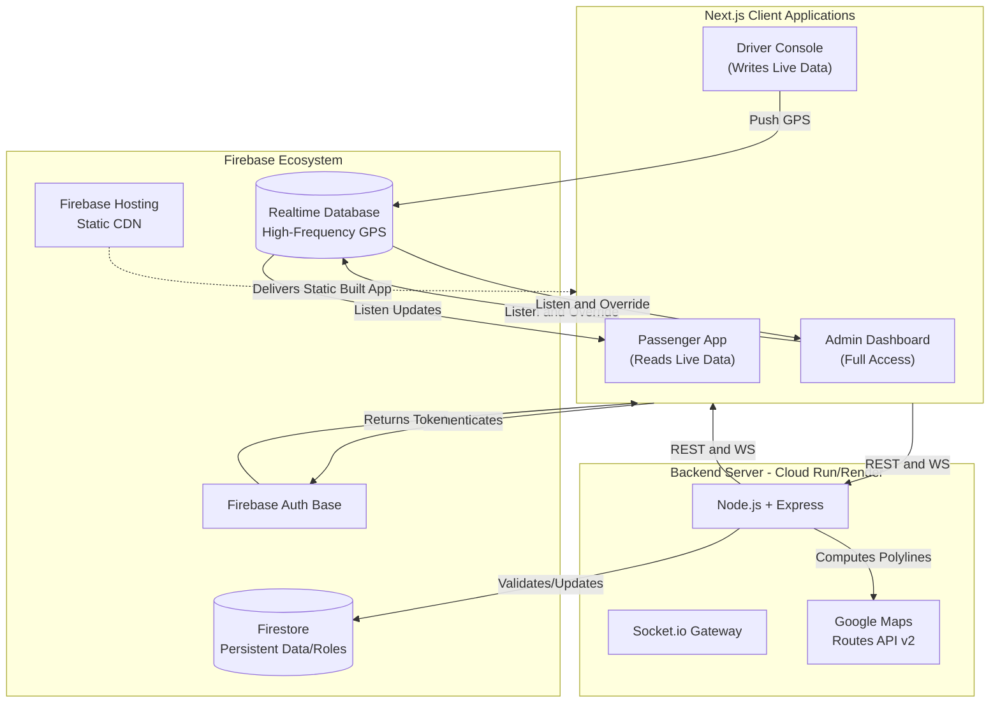
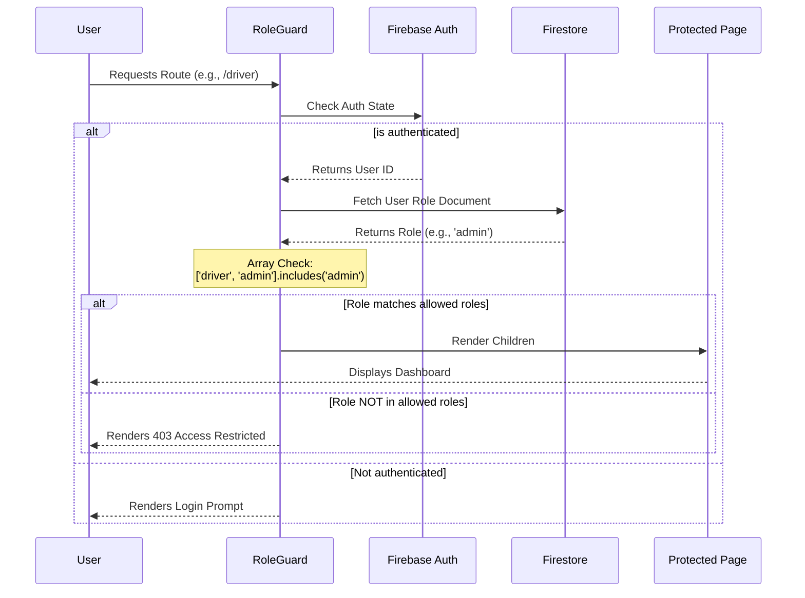
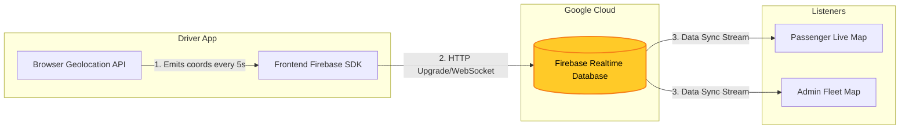
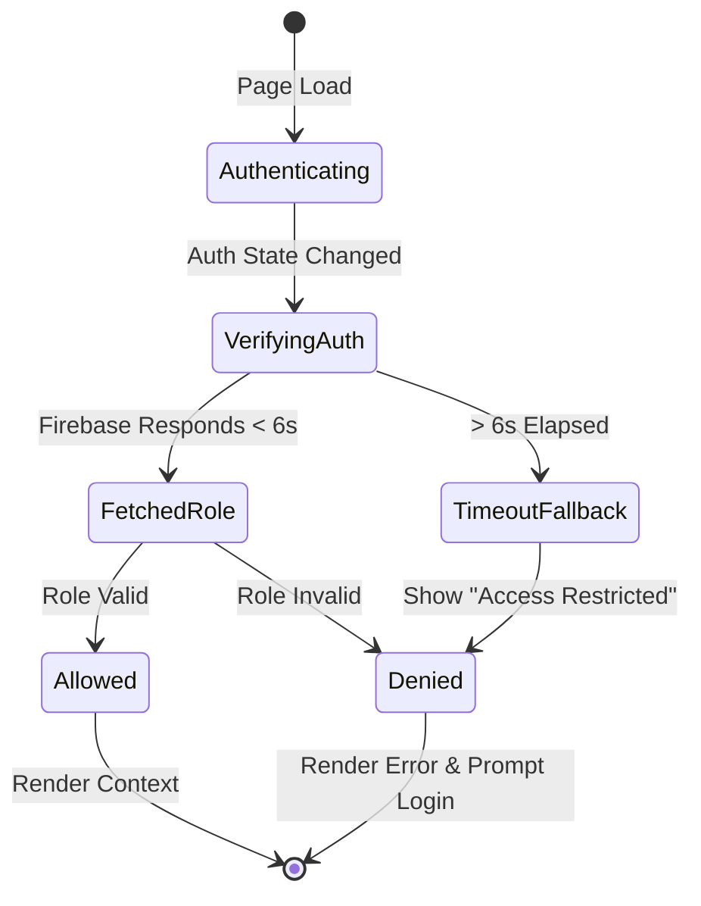

# BusTrack Architecture & Data Flow

This document details the core architecture, data synchronization flows, and Role-Based Access Control (RBAC) hierarchy of the BusTrack ecosystem.

## 1. High-Level Architecture

BusTrack uses a modern hybrid, real-time architecture leveraging Firebase as the core streaming layer and a containerized Node.js backend for heavy computation. 

## 2. Role-Based Access Control (RBAC) Flow

The system employs a strict hierarchical Role-Based Access Control pattern. The `RoleGuard` wrapper checks a user's role initialized via Google Authentication against the page's permitted roles. 

### Role Hierarchy
* **Admin:** Inherits all permissions. Can view `/admin`, `/driver`, and `/passenger`.
* **Driver:** Can view `/driver` and `/passenger`.
* **Passenger:** Can only view `/passenger`.

## 3. Real-Time GPS Tracking Data Flow

Location updates happen completely outside the standard Node.js server. The Drivers stream directly to the Firebase Realtime Database (RTDB), which in turn publishes the updates to the Passenger app, ensuring sub-second latency globally.

## 4. Auth Fallback & Loading Cycle

As implemented in `RoleGuard`, to prevent infinite loading screens when Firestore latency issues occur or network connections drop:

## 5. Backend Dockerization

The Node.js backend (located in the `/backend` directory) includes a `Dockerfile` and `.dockerignore`. While Firebase (RTDB & Firestore) efficiently handles direct client-to-database real-time streaming, the Dockerized Node.js backend exists to securely manage operations that cannot be handled directly from the client:

* **Heavy Computation:** Interacting with the Google Maps Routes API v2 to compute complex polylines and ETAs.
* **Security & Validation:** Hiding sensitive Server API keys and enforcing complex business logic or data validation before updating Firestore.
* **WebSocket Management:** Running a Socket.io gateway for advanced client-server communications.

The `Dockerfile` packages this Express server into an isolated container. This allows the backend to be deployed anywhere that supports containers (like **Google Cloud Run** or **Render**), ensuring it scales automatically and runs consistently across development, staging, and production environments.
