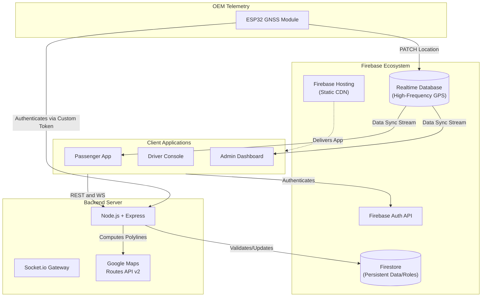

# BusTrackr Documentation

## 1. Table of Contents
- [1. Table of Contents](#1-table-of-contents)
- [2. Executive Summary](#2-executive-summary)
- [3. System Architecture](#3-system-architecture)
- [4. Tech Stack](#4-tech-stack)
- [5. Repository Structure](#5-repository-structure)
- [6. Data Flow / Pipeline](#6-data-flow--pipeline)
- [7. API Reference](#7-api-reference)
- [8. Data Models / Schema](#8-data-models--schema)
- [9. GTFS-Realtime Integration](#9-gtfs-realtime-integration)
- [10. Configuration & Environment](#10-configuration--environment)
- [11. Setup & Local Development](#11-setup--local-development)
- [12. Deployment & Infrastructure](#12-deployment--infrastructure)
- [13. Testing](#13-testing)
- [14. Known Limitations, Edge Cases, TODOs](#14-known-limitations-edge-cases-todos)
- [15. Roadmap](#15-roadmap)
- [16. Glossary](#16-glossary)

---

## 2. Executive Summary

BusTrackr is a full-stack, real-time fleet management and tracking ecosystem designed for the Ahmedabad University fleet and the broader Ahmedabad BRTS network. It provides live GPS tracking, on-demand passenger requests, and comprehensive fleet oversight for administrators. By bridging custom OEM hardware telemetry (ESP32) directly to Firebase Realtime Database and serving it through a Next.js/Node.js stack, it eliminates manual driver interaction for location updates and minimizes latency for commuters viewing ETAs.

---

## 3. System Architecture



### Component Responsibilities
- **OEM Telemetry (ESP32):** Reads raw GPS NMEA data, filters stationary drift (HDOP gate and EMA smoothing), determines moving status, and pushes optimized delta updates directly to Firebase RTDB.
- **Firebase Ecosystem:** Acts as the primary real-time pub/sub layer. RTDB handles high-frequency location data from the hardware and syncs it instantly to the passenger and admin frontends. Firestore stores persistent state like user roles, registered devices, and route structures.
- **Backend Server (Node/Express):** Functions as the REST abstraction layer and heavy-compute offloader. It authenticates hardware devices, interacts securely with the paid Google Maps Routes API (to compute polylines without exposing API keys), and manages passenger requests.
- **Frontend Clients (Next.js):** Browser-based portals for Passengers (viewing live buses/routes), Drivers (receiving passenger requests), and Admins (fleet overview and analytics). 

---

## 4. Tech Stack

| Layer | Technology | Version | Purpose |
|---|---|---|---|
| Frontend Framework | Next.js | 16.2.1 | UI rendering, static export generation, routing |
| Frontend UI | React / Tailwind CSS | 19.2.4 / v4 | Component architecture and styling |
| Maps (Browser) | Leaflet / React-Leaflet | 1.9.4 / 5.0.0 | Rendering interactive maps and polylines |
| Backend Server | Node.js + Express | 4.19.2 | REST abstraction layer and secure operations |
| Real-Time Comm | Socket.io | 4.7.5 | Bidirectional event streaming (fallback for RTDB) |
| Hardware / C++ | PlatformIO / Arduino | - | ESP32 firmware compilation and deployment |
| JSON Parsing (HW) | ArduinoJson | ^7.0.0 | Parsing backend Custom Token auth responses |
| Database | Firebase RTDB & Firestore | ^13.7.0 (Admin) | High-frequency telemetry sync (RTDB) and persistent data (Firestore) |
| Maps (Server) | Google Routes API v2 | - | Computing distances, durations, and encoded polylines |

---

## 5. Repository Structure

```text
/
├── .agents/                    # Agent customizations and workspace rules
├── .firebase/                  # Firebase hosting cache and configurations
├── .github/                    # CI/CD workflows and actions
├── backend/                    # Node.js + Express backend server
│   ├── src/
│   │   ├── lib/                # Firebase admin and ETA service singletons
│   │   ├── middleware/         # Admin RBAC enforcement and auth guards
│   │   ├── routes/             # Express REST API controllers (buses, plan, polyline, etc.)
│   │   ├── socket/             # Socket.io gateway implementations
│   │   └── types/              # Shared TypeScript data models
│   ├── Dockerfile              # Backend containerization config
│   └── package.json            # Backend dependencies
├── BusTracking/                # ESP32 C++ Firmware for OEM Telemetry
│   ├── include/                # Header files (secrets.h configuration)
│   ├── src/                    # main.cpp (GNSS parsing, smart transmission, Firebase client)
│   └── platformio.ini          # Hardware build configuration
├── frontend/                   # Next.js 16 Web Applications
│   ├── src/
│   │   ├── app/                # Next.js App Router pages (admin, driver, passenger)
│   │   ├── components/         # Reusable React UI and Map components
│   │   ├── config/             # Hardcoded BRTS routes and environment maps
│   │   ├── hooks/              # Custom React hooks (buses, routing, simulation)
│   │   └── lib/                # Client-side Firebase init and map utilities
│   ├── package.json            # Frontend dependencies
│   └── tailwind.config.ts      # CSS design tokens (BRTS colors)
├── functions/                  # Firebase Cloud Functions (isolated microservices)
├── ARCHITECTURE.md             # High-level data flow and RBAC diagrams
├── database.rules.json         # Firebase Realtime Database security rules
├── firestore.rules             # Firebase Firestore security rules
├── GNSS_HARDWARE_MIGRATION.md  # Migration plan for moving from browser GPS to hardware GNSS
└── README.md                   # Installation and setup instructions
```

---

## 6. Data Flow / Pipeline

Trace of a single bus location update from hardware to passenger:

1. **Telemetry Generation (`BusTracking/src/main.cpp`):** The ESP32's `TinyGPSPlus` parses raw NMEA data from the GNSS module.
2. **Filtering & Smart Delta:** The firmware checks if the signal is stable (`gps.hdop() <= 4.0`) and calculates distance moved from an Exponential Moving Average reference position. If the bus moved >10m, changed heading >15deg, or a 30s heartbeat interval passed, an update is triggered.
3. **Auto-Live Status:** The firmware dynamically assigns `status: "active"` if speed is >= 8.0 km/h, else `status: "idle"`.
4. **Ingestion (Firebase RTDB):** The ESP32 sends an HTTP PATCH request directly to `https://<FIREBASE_HOST>/activeBuses/bus_01_route_01` containing the JSON payload.
5. **Consumption (`frontend/src/components/maps/PassengerMap.tsx`):** The passenger's browser maintains an active WebSocket listener on the `/activeBuses` RTDB reference. The new coordinate triggers a React state update.
6. **Rendering:** Leaflet re-renders the bus marker icon at the new `lat`/`lng` and recalculates the ETA to the target stop using the `getDistanceMeters` local math function. 

*(Note: There is no GTFS-RT output in this pipeline. See Section 9).*

---

## 7. API Reference

All backend routes are prefixed with `/api` except `/health`.

| Method | Path | Auth | Payload / Params | Response | Description |
|---|---|---|---|---|---|
| `GET` | `/health` | None | None | `{ status: "ok", firebase: "connected", timestamp: string }` | Server health and Firestore connection probe. |
| `GET` | `/api/buses` | None | None | `{ buses: BusLocation[] }` | Returns in-memory snapshot of active buses. |
| `GET` | `/api/buses/:busId` | None | `busId` (URL Param) | `BusLocation` object | Retrieves specific bus by ID. Returns 404 if not active. |
| `PATCH` | `/api/buses/:busId` | Admin | `{ status: string }` | Updated `BusLocation` | Overrides a bus status manually (must be active/idle/maintenance). |
| `GET` | `/api/analytics/fleet` | None | None | `{ totalBuses, activeBuses, idleBuses, maintenanceBuses, ongoingTrips, passengerCount }` | Aggregates counts from Firestore `bus_locations` collection. |
| `GET` | `/api/analytics/trips` | None | None | `{ trips: [] }` | Currently stubbed; returns empty array. |
| `GET` | `/api/analytics/feedback` | None | None | `{ feedback: [] }` | Currently stubbed; returns empty array. |
| `POST` | `/api/requests` | None | `{ passengerId, busId, type, lat, lng }` | `PassengerRequest` | Creates a new pickup/dropoff request and stores in memory. |
| `GET` | `/api/requests` | None | None | `{ requests: PassengerRequest[] }` | Lists all pending requests (uses `no-store` cache control). |
| `PATCH` | `/api/requests/:id` | Admin | `{ status: string }` | Updated `PassengerRequest` | Overrides request status. |
| `DELETE`| `/api/requests/:id` | Admin | `id` (URL Param) | `{ message: "Deleted successfully" }` | Cancels and removes request from memory. |
| `POST` | `/api/plan` | None | `{ routeId, startStopId, endStopId, viaStopId? }` | `{ routeId, routeName, routeColor, startStop, endStop, viaStop, stopsOnSegment, polyline, totalStops }` | Slices a pre-stored encoded polyline between stops using pure math. Zero API cost. |
| `GET` | `/api/routes-list` | None | None | `{ routes: RouteOverview[] }` | Fetches route overviews from Firestore `routes` collection. |
| `POST` | `/api/devices/auth` | None | `{ deviceId, secret }` | `{ token: string, expiresIn: number }` | Validates secret against Firestore `devices` doc, issues Firebase Custom Token. |
| `POST` | `/api/routes/compute-polyline`| Admin | `{ waypoints: { lat, lng }[] }` | `{ polyline: string, distanceMeters: number, duration: string }` | Proxies request to Google Maps Routes API v2 to bake polylines. |

*(Auth "Admin" implies the request must pass the `requireAdmin` middleware checking `req.headers.authorization` for a valid Firebase ID Token with admin claims).*

---

## 8. Data Models / Schema

### Realtime Database (RTDB)
**`activeBuses/{busId}_{routeId}`**
- `busId` (string)
- `driverId` (string)
- `routeId` (string)
- `lat` (number)
- `lng` (number)
- `heading` (number)
- `speed` (number)
- `status` (string: "active" | "idle" | "maintenance")
- `timestamp` (number, server-injected via `.sv`)
- `source` (string: "gnss_hw")
- `satellites` (number)
- `hdop` (number)

### Firestore Collections

**`devices`**
- Document ID: Matches hardware `deviceId` (e.g., `bus_01`).
- `secret` (string): 32-byte auth secret used by ESP32 to fetch Custom Tokens.

**`routes`**
- Document ID: Matches `routeId`.
- `name` (string): Human readable name.
- `color` (string): Hex color code.
- `polyline` (string): Google Encoded Polyline string for the entire route.
- `stops` (Array of Objects):
  - `id`, `name`, `shortName`, `lat`, `lng`, `waypointIndex`.
- `waypoints` (Array of Objects):
  - `lat`, `lng`.

**`bus_locations`**
- Used by analytics to track persistent fleet state.
- Fields mirror the RTDB `activeBuses` schema.

**In-Memory Models (Node.js)**
- `pendingRequests`: Map tracking `PassengerRequest` (passengerId, busId, type, lat, lng, status).

---

## 9. GTFS-Realtime Integration

**Not found in repo — needs manual input.**

Despite mentions in external context regarding bridging OEM vehicle telemetry with the GTFS-Realtime spec, there is absolutely **zero** GTFS or GTFS-RT implementation in the current codebase. 
- There are no GTFS protocol buffer dependencies (e.g., `gtfs-realtime-bindings`) in either `package.json`.
- There are no backend routes emitting GTFS-RT feeds (`VehiclePosition`, `TripUpdate`, or `Alert`).
- The data flow operates entirely on proprietary JSON schemas synced via Firebase RTDB and custom REST endpoints.

---

## 10. Configuration & Environment

### Backend (`backend/.env`)
- `PORT`: HTTP port for Express server (default: 4000).
- `NODE_ENV`: Standard environment flag.
- `CORS_ORIGIN`: Allowed frontend origin.
- `FIREBASE_SERVICE_ACCOUNT`: Stringified JSON of the Firebase Admin SDK service account key.
- `GOOGLE_MAPS_API_KEY`: Server-side API key for hitting the Routes API v2 (used in `compute-polyline`).
- `ADMIN_API_SECRET`: Fallback secret for backend admin operations.
- `ETA_INTERVAL_MS`: Polling interval for ETA updates.

### Frontend (`frontend/.env.local`)
- `NEXT_PUBLIC_FIREBASE_*`: Standard Firebase client initialization keys.
- `NEXT_PUBLIC_GOOGLE_MAPS_API_KEY`: Browser-side API key restricted to domains for Leaflet/Google Maps.
- `NEXT_PUBLIC_BACKEND_URL`: Public URL of the Express server.
- `NEXT_PUBLIC_SOCKET_URL`: Public URL for Socket.io connections.
- `BACKEND_URL`: Server-side only URL for Next.js API routes/SSR.

### Hardware (`BusTracking/include/secrets.h`)
- `WIFI_SSID` / `WIFI_PASS`: Local network credentials for ESP32.
- `FIREBASE_HOST`: RTDB endpoint URL.
- `BACKEND_URL`: IP/Domain of the Express backend for the ESP32 to POST to `/api/devices/auth`.
- `DEVICE_SECRET`: The hardware-specific secret string to authenticate with the backend.

---

## 11. Setup & Local Development

**Prerequisites:** Node.js ≥ 20.x, npm ≥ 10.x, PlatformIO (for hardware), Firebase CLI.

1. **Install Dependencies:**
   Run `npm install` in the root, `frontend`, and `backend` directories.
2. **Environment Variables:**
   Copy `.env.example` to `.env` in the backend, and set up `.env.local` in the frontend according to the Configuration section.
3. **Database Seeding:**
   From the backend directory, run `npm run seed` to populate Firestore with initial routes.
4. **Run Servers Concurrently:**
   From the root, run `npm run dev`. This utilizes a custom script/concurrently setup to launch both Next.js (`localhost:3000`) and Express (`localhost:4000`).
5. **Hardware Compilation:**
   Open the `BusTracking` folder in VS Code with the PlatformIO extension. Edit `secrets.h`, connect the ESP32, and click "Upload".

---

## 12. Deployment & Infrastructure

- **Frontend:** Built via `next build` (configured as a static export via `next.config.ts`) and deployed to Firebase Hosting using `firebase deploy --only hosting`.
- **Backend:** Containerized using the provided `backend/Dockerfile`. It uses `node:20-alpine`, builds the TypeScript code (`npm run build`), and exposes port 8080. Deployed to Google Cloud Run or Render.
- **Hardware:** Deployed directly to ESP32 modules via physical flashing.
- **CI/CD:** A `.github` directory exists for automated workflows, but specific pipeline configurations are not detailed in the docs.

---

## 13. Testing

- **Backend:** Uses the `vitest` framework. Tests are located in `backend/src/tests/` (inferred from directory structure). Run via `npm run test` inside the backend folder.
- **Frontend:** No automated test suite (Jest/Cypress) is configured in `package.json`.
- **Hardware:** No unit testing framework configured in `platformio.ini`.

---

## 14. Known Limitations, Edge Cases, TODOs

- **Analytics Stubbed:** The `/api/analytics/trips` and `/api/analytics/feedback` routes currently return hardcoded empty arrays. A dedicated analytics collection must be implemented in Firestore.
- **BRTS Data Mocking:** While the backend serves routes from Firestore, BRTS integration heavily relies on hardcoded configurations in `frontend/src/config/brtsRoutes.ts` and `predefinedRoutes.ts` rather than dynamic fetching in several simulation components.
- **Leaflet SSR Issues:** Next.js Server-Side Rendering conflicts with Leaflet's `window` dependencies. The codebase utilizes `dynamic` imports with `ssr: false` and a `fix-leaflet-ssr.js` script to mitigate this.
- **Hardware Dependency:** The frontend explicitly does not allow drivers to broadcast location via `navigator.geolocation` (enforced by workspace rules). The system will not function without the physical ESP32 hardware online.

---

## 15. Roadmap

- **GTFS-Realtime Integration:** The stated goal is to act as a translation layer converting the current proprietary RTDB JSON schema into standard GTFS-RT Protocol Buffers for public transit aggregators (currently entirely unwritten).
- **Ahmedabad BRTS Expansion:** Transitioning the mocked BRTS routes (`brtsRoutes.ts`) into fully managed, database-driven configurations handled through the Admin portal's infrastructure management tools.

---

## 16. Glossary

- **BRTS:** Bus Rapid Transit System (specifically referencing the Ahmedabad Janmarg system).
- **OEM Telemetry:** Original Equipment Manufacturer data; in this context, the custom ESP32 hardware module attached to the bus extracting GNSS data.
- **REST Abstraction Layer:** The Node.js/Express backend server that mediates authentication, heavy computation (polylines), and business logic, separating the raw hardware data from the client UI.
- **GTFS:** General Transit Feed Specification. A standard format for public transportation schedules and associated geographic information.
- **GTFS-Realtime:** An extension to GTFS providing live updates (Vehicle Positions, Trip Updates, Alerts) in Protocol Buffer format.
- **RTDB:** Firebase Realtime Database. The NoSQL JSON database used for sub-second, low-latency syncing of live bus coordinates.
- **HDOP:** Horizontal Dilution of Precision. A metric of GPS accuracy used by the hardware to reject multipath signal noise.
- **EMA:** Exponential Moving Average. A mathematical smoothing function used on the hardware to prevent GPS coordinate jitter while stationary.
