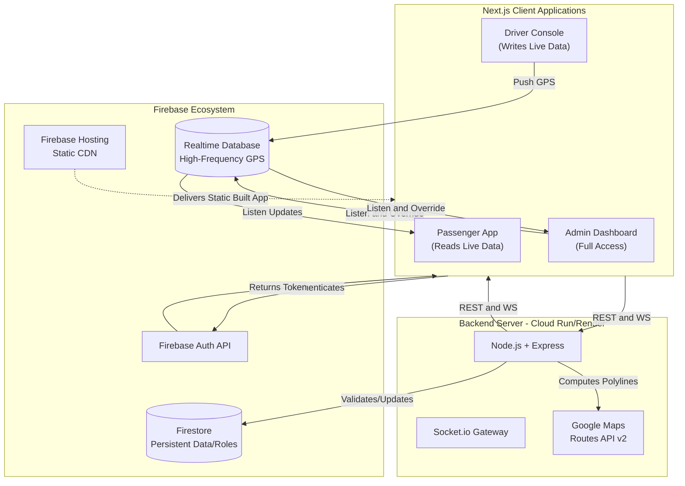
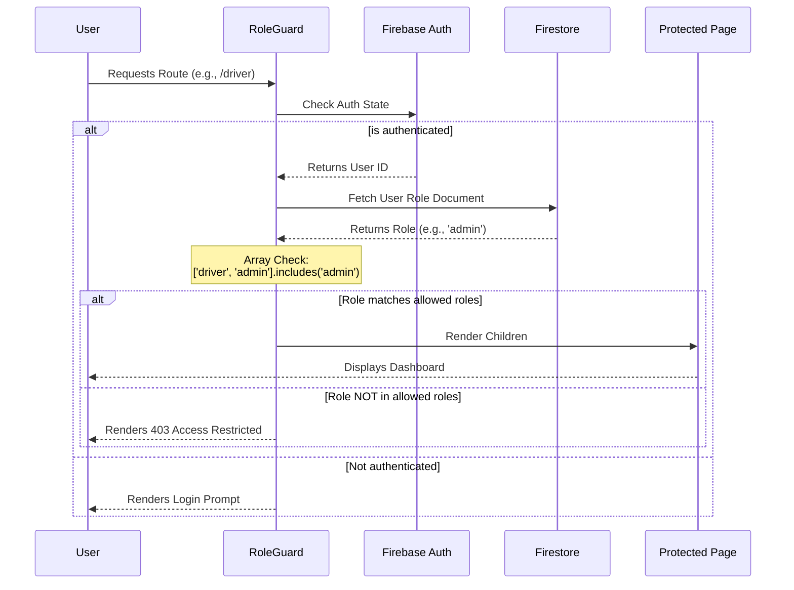
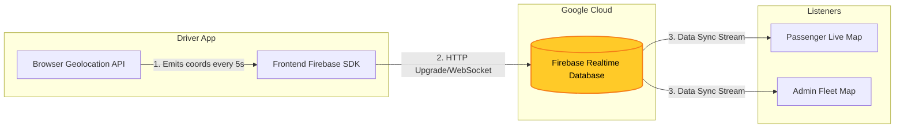
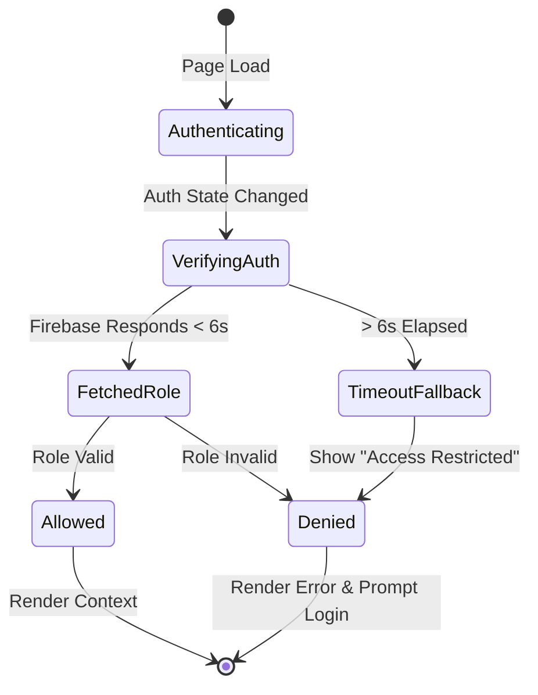

# BusTrack — Ahmedabad BRTS Real-Time Fleet System
> This version of the application does use the Browser Geolocation API (navigator.geolocation) to determine and track users' real-time locations:

Passenger Tracking: In PassengerMap.tsx, it uses navigator.geolocation.watchPosition to track and display the passenger's current location on the map.
Driver Tracking: In driver/page.tsx, it uses navigator.geolocation.getCurrentPosition to obtain the driver's location.

> Live GPS tracking, on-demand stops, and complete fleet oversight — seamlessly connecting passengers, drivers, and administrators across Ahmedabad's BRTS network.

---

## Overview

BusTrack is a full-stack real-time bus tracking platform with three interconnected portals:

| Portal | Role | Key Features |
|---|---|---|
| **Passenger** | Commuters | Live bus map, ETA display, on-demand pickup/dropoff requests |
| **Driver** | Bus operators | GPS broadcast, incoming request feed, route navigation |
| **Admin** | Fleet managers | Bird's-eye fleet map, analytics dashboard, route infrastructure management |

**Architecture:** Next.js static frontend → Firebase Hosting → Socket.io backend (Cloud Run) → Google Cloud Firestore

---

## Tech Stack

| Layer | Technology |
|---|---|
| Frontend | Next.js 16, React 19, TypeScript, Tailwind CSS v4 |
| Maps | Google Maps JavaScript API (browser), Google Routes API v2 (server) |
| Backend | Node.js, Express 4, Socket.io 4, TypeScript |
| Database | Google Cloud Firestore |
| Auth | Firebase Authentication |
| Hosting | Firebase Hosting (frontend), Cloud Run / Docker (backend) |
| Security | Helmet, express-rate-limit |

---

## Prerequisites

- Node.js ≥ 20.x
- npm ≥ 10.x
- A Google Cloud project with the following APIs enabled:
  - Maps JavaScript API
  - Routes API (v2)
  - Places API
- A Firebase project with Firestore and Authentication enabled
- Firebase CLI: `npm install -g firebase-tools`

---

## Installation

```bash
# 1. Clone the repository
git clone https://github.com/AryanPatelOnGIT/Bus_Track.git
cd Bus_Track

# 2. Install all workspace dependencies
npm install

# 3. Configure environment variables
cp backend/.env.example backend/.env
# — fill in backend/.env with your credentials

# Edit frontend/.env.local with your Firebase + Maps keys
# (see Environment Variables section below)
```

---

## Environment Variables

### Backend (`backend/.env`)

```env
PORT=4000
NODE_ENV=development
CORS_ORIGIN=http://localhost:3000

# Firebase Service Account JSON (stringify the downloaded JSON file)
FIREBASE_SERVICE_ACCOUNT='{...}'

# Google Maps — SERVER key (restrict to your server IP + Routes API in GCP Console)
GOOGLE_MAPS_API_KEY=your_routes_api_key_here

# Admin secret (generate: openssl rand -hex 32)
ADMIN_API_SECRET=your_long_random_secret_here

# ETA interval in ms (default 180000 = 3 min)
ETA_INTERVAL_MS=180000
```

### Frontend (`frontend/.env.local`)

```env
# Firebase public config (safe to expose — restricted by Firebase Security Rules)
NEXT_PUBLIC_FIREBASE_API_KEY=...
NEXT_PUBLIC_FIREBASE_AUTH_DOMAIN=...
NEXT_PUBLIC_FIREBASE_PROJECT_ID=...
NEXT_PUBLIC_FIREBASE_STORAGE_BUCKET=...
NEXT_PUBLIC_FIREBASE_MESSAGING_SENDER_ID=...
NEXT_PUBLIC_FIREBASE_APP_ID=...

# Google Maps — BROWSER key (restrict to your domain + Maps JS API in GCP Console)
NEXT_PUBLIC_GOOGLE_MAPS_API_KEY=your_browser_key_here
NEXT_PUBLIC_GOOGLE_MAPS_KEY=your_browser_key_here

# Backend URLs (public — just URLs, not secrets)
NEXT_PUBLIC_BACKEND_URL=http://localhost:4000
NEXT_PUBLIC_SOCKET_URL=http://localhost:4000

# Server-only (no NEXT_PUBLIC_ prefix — never sent to browser)
BACKEND_URL=http://localhost:4000
ADMIN_API_SECRET=your_long_random_secret_here
```

> ⚠️ **CRITICAL:** Never use the same API key for browser and server. Create two separate keys in GCP Console with different HTTP referrer and IP restrictions.

---

## Execution Instructions

### Development

```bash
# Run frontend + backend concurrently
npm run dev

# Frontend only: http://localhost:3000
# Backend only:  http://localhost:4000
```

### Seed Routes into Firestore

```bash
cd backend && npm run seed
```

### Production Build

```bash
# Build Next.js frontend (static export)
npm run build

# Deploy frontend to Firebase Hosting
firebase deploy --only hosting

# Build backend Docker image
cd backend && docker build -t bustrack-backend .

# Run backend container
docker run -p 8080:8080 --env-file .env bustrack-backend
```

---

## Architecture & Data Flow

BusTrack uses a modern hybrid, real-time architecture leveraging Firebase as the core streaming layer and a containerized Node.js backend for heavy computation. 

**Why Docker in the Backend?** While Firebase handles direct real-time syncing between clients effectively, the backend is strictly reserved for secure operations that cannot be exposed to the frontend (like Google Maps Routes API interactions) and advanced Socket.io communications. The `Dockerfile` packages this server into a standardized container, allowing seamless deployment to auto-scaling services like Google Cloud Run or Render.

### 1. High-Level Hub



### 2. Role-Based Access Control (RBAC) Hierarchy

The system employs a strict hierarchical Role-Based Access Control pattern. The `RoleGuard` wrapper checks a user's role initialized via Google Authentication against the page's permitted roles. 

* **Admin:** Inherits all permissions. Can view `/admin`, `/driver`, and `/passenger`.
* **Driver:** Can view `/driver` and `/passenger`.
* **Passenger:** Can only view `/passenger`.



### 3. Real-Time GPS Data Flow

Location updates happen completely outside the standard Node.js server. The Drivers stream directly to the Firebase Realtime Database (RTDB), which in turn publishes the updates to the Passenger app, ensuring sub-second latency globally.



### 4. Auth Fallback & Loading Cycle

As implemented in `RoleGuard`, to prevent infinite loading screens when Firestore latency issues occur or network connections drop:



---

## API Reference

### REST Endpoints

| Method | Path | Auth | Description |
|---|---|---|---|
| GET | `/health` | None | Server health check |
| GET | `/api/buses` | Auth | List all active buses |
| GET | `/api/buses/:busId` | Auth | Get specific bus |
| PATCH | `/api/buses/:busId` | Admin | Override bus status |
| GET | `/api/analytics/fleet` | Auth | Fleet statistics |
| POST | `/api/requests` | Auth | Create passenger request |
| GET | `/api/requests` | Auth | List all requests |
| PATCH | `/api/requests/:id` | Admin | Update request status |
| DELETE | `/api/requests/:id` | Admin | Cancel request |
| POST | `/api/routes/compute-polyline` | Admin Secret | Bake route polyline |

### Socket Events (Client → Server)

| Event | Payload | Description |
|---|---|---|
| `driver:start-tracking` | `{busId, driverId, routeId?}` | Driver goes live |
| `driver:location-update` | `{busId, driverId, lat, lng, heading, speed, timestamp}` | GPS update |
| `driver:route-update` | `{busId, routeId}` | Change assigned route |
| `driver:stop-tracking` | `{busId}` | Driver goes offline |
| `passenger:join` | — | Subscribe to live updates |
| `passenger:request` | `{passengerId, busId, type, lat, lng}` | Request pickup/dropoff |
| `admin:join` | — | Subscribe to admin feed |

---

## Security Notes

1. **API Keys:** Create separate keys for browser and server in GCP Console. Set HTTP referrer restrictions on browser keys and IP restrictions on server keys.
2. **Firebase Service Account:** In production, use Google Cloud Secret Manager or Workload Identity Federation instead of storing JSON in `.env`.
3. **Admin Secret:** Generate with `openssl rand -hex 32`. Rotate immediately if compromised.
4. **Firestore Rules:** Deploy rules with `firebase deploy --only firestore:rules` after any changes.
5. **HTTPS Only:** Always deploy behind HTTPS. The backend must be behind a TLS-terminating load balancer.

---

## Project Structure Notes

You may notice multiple `node_modules` folders in the repository. Here is why they are separated:

- **`./node_modules` (Root Directory):** Contains the dependencies installed for the overall workspace and root-level scripts (such as `serve.js`, `simulator.js`, and `fix-leaflet-ssr.js`).
- **`./functions/node_modules`:** Contains dependencies exclusively for Firebase Cloud Functions. Since Firebase Functions operate as independent serverless microservices, they are bundled and deployed entirely separately to Google Cloud. Because of this isolated environment, they require their own `package.json` and `node_modules` directory to run correctly in the cloud.
