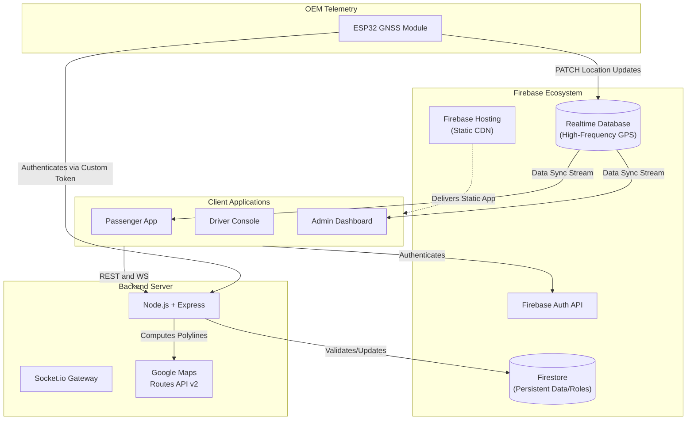

# Eki (BusTrack) — Enterprise Fleet Tracking & Management System

> Live GPS tracking, on-demand commuter requests, and comprehensive fleet oversight seamlessly connecting passengers, drivers, and administrators across the Ahmedabad BRTS network.

---

## Overview

BusTrack is a full-stack, real-time fleet management ecosystem designed for scale. By bridging custom OEM hardware telemetry (ESP32) directly to a Firebase real-time streaming layer and serving it through a Next.js/Node.js stack, it eliminates manual driver interaction for location updates and minimizes latency for commuters viewing ETAs.

The system is composed of three primary surfaces:
1. **Passenger App**: Interactive live maps, ETA calculations, and on-demand pickup/dropoff requests.
2. **Admin Dashboard**: Bird's-eye fleet map, historical analytics, and route infrastructure management.
3. **Hardware Telemetry**: Dedicated ESP32 GNSS modules physically installed on buses, autonomously streaming high-frequency location data.

---

## System Architecture

BusTrack utilizes a modern hybrid architecture. It leverages **Firebase Realtime Database** as a sub-second pub/sub streaming layer, while offloading secure operations and heavy computations (like Google Maps Routes API polyline calculations) to a containerized **Node.js/Express Backend**.



---

## Tech Stack

| Layer | Technologies Used |
|---|---|
| **Frontend** | Next.js 16 (App Router), React 19, TypeScript, Tailwind CSS v4, React-Leaflet |
| **Backend** | Node.js, Express 4, Socket.io 4, TypeScript, Docker |
| **Hardware** | ESP-WROOM-32, NEO-M8N GNSS, PlatformIO, ArduinoJson |
| **Database & Auth** | Google Cloud Firestore, Firebase Realtime Database, Firebase Authentication |
| **Mapping & GIS** | Google Maps JavaScript API (Client), Google Routes API v2 (Server) |

---

## Repository Structure

This repository is structured as a monorepo, cleanly separating the distinct operational domains of the ecosystem.

```text
Eki/
├── backend/       # Node.js server (WebSocket gateway, Routes API, secure ops)
├── docs/          # Deep-dive architecture, hardware migration, and system workflows
├── frontend/      # Next.js web applications (Passenger, Driver, Admin portals)
├── hardware/      # PlatformIO/C++ firmware for ESP32 GNSS telemetry modules
└── scripts/       # Repository-wide utility and build scripts
```

---

## Prerequisites & Installation

To run this ecosystem locally, you will need:
- **Node.js** ≥ 20.x
- **PlatformIO** (if compiling hardware firmware)
- A **Google Cloud Project** with Maps JavaScript API and Routes API v2 enabled.
- A **Firebase Project** with Authentication, Firestore, and Realtime Database initialized.

### 1. Clone & Install
```bash
git clone https://github.com/AryanPatelOnGIT/Bus_Track.git
cd Bus_Track
npm install
```

### 2. Environment Configuration
You must configure environment variables for both the backend and frontend.

**Backend (`backend/.env`):**
Requires your Firebase Admin Service Account JSON and a Google Maps Server Key (IP Restricted).
```bash
cp backend/.env.example backend/.env
# Edit backend/.env with your credentials
```

**Frontend (`frontend/.env.local`):**
Requires your Firebase public config and a Google Maps Browser Key (HTTP Referrer Restricted).
```env
NEXT_PUBLIC_FIREBASE_API_KEY=your_public_key
NEXT_PUBLIC_GOOGLE_MAPS_API_KEY=your_browser_key
# ... see frontend/README.md for full list
```

---

## Running the Application

### Development Mode
You can spin up both the Next.js frontend and the Express backend concurrently from the root directory:
```bash
npm run dev
```
- **Frontend:** [http://localhost:3000](http://localhost:3000)
- **Backend:** [http://localhost:4000](http://localhost:4000)

### Production Build
To create a production-optimized static export of the frontend and compile the backend TypeScript:
```bash
npm run build
```

---

## Documentation Index

For detailed explanations of the system architecture, hardware integration, and security model, please refer to our deep-dive documentation:

- [System Architecture & RBAC Flow](docs/architecture.md)
- [GNSS Hardware Migration Guide](docs/gnss_hardware_migration.md)
- [System Workflows](docs/workflow_explanation.md)
- [Hardware Telemetry & Security](hardware/README.md)
- [Frontend Workspace](frontend/README.md)
- [Backend Workspace](backend/README.md)
