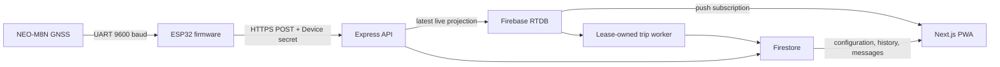
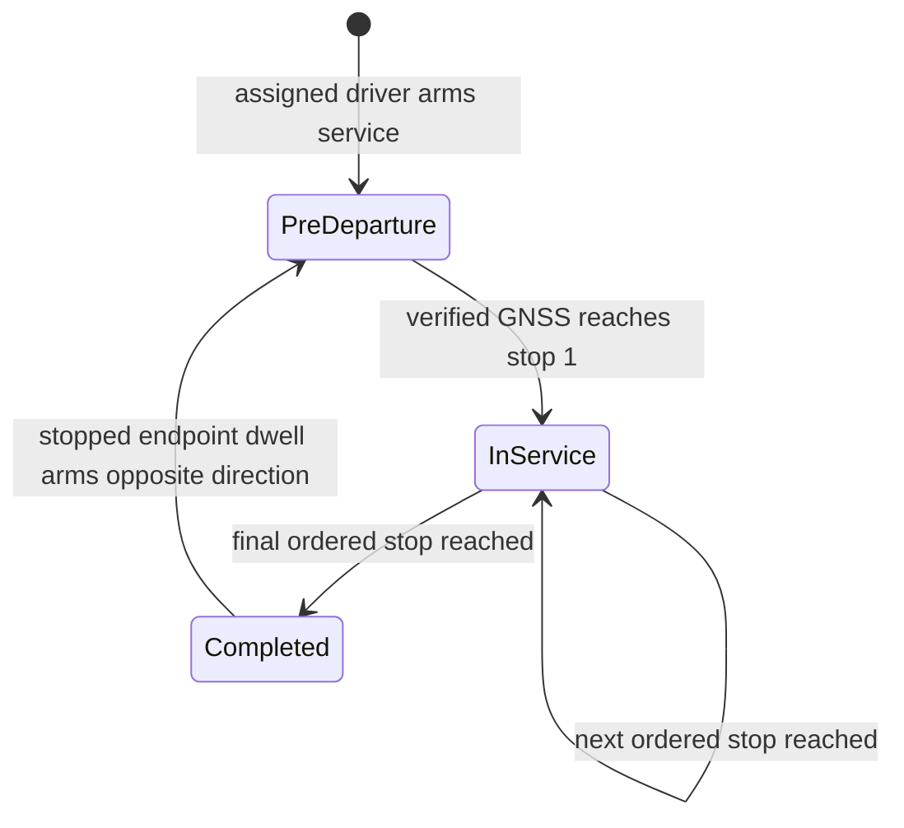

# Eki campus bus tracking

## Fast recovery: backend, tunnel, panel, and ESP32

Use these commands when the ESP reports `DNS Failed` or the tunnel hostname has
expired. Run each block in a separate terminal and keep Terminals 1 and 2 open.

**1. Start the backend (Terminal 1):**

```powershell
cd C:\Users\Naman Sinha\Desktop\Eki
npm run dev --workspace=backend
```

**2. Create and verify a fresh HTTPS tunnel (Terminal 2):**

```powershell
cloudflared tunnel --protocol http2 --url http://localhost:4000
# Copy the generated URL, for example:
$BackendOrigin = "https://<generated-host>.trycloudflare.com"
Invoke-RestMethod "$BackendOrigin/health"
```

The health response must be `{"status":"ok"}`. A Quick Tunnel URL expires when
`cloudflared` stops, so repeat every consumer update below whenever it changes.

**3. Update the local configuration:**

```powershell
notepad hardware/include/secrets.h       # set BACKEND_URL to $BackendOrigin
notepad frontend/.env.local               # set NEXT_PUBLIC_BACKEND_URL
notepad frontend/.env.production          # set NEXT_PUBLIC_BACKEND_URL
```

Never put the tunnel URL in `backend/.env`. The ESP URL is compiled into the
firmware, so it requires a rebuild and reflash.

**4. Deploy the hosted panel (Terminal 3):**

```powershell
$env:NEXT_PUBLIC_BACKEND_URL = $BackendOrigin
npm run deploy
```

Setting the environment variable explicitly makes the generated Firebase CSP
allow the same backend origin used by the hosted panel.

**5. Rebuild and flash the ESP32 (Terminal 4):**

```powershell
py -m platformio run --project-dir hardware -e esp32dev
py -m platformio run --project-dir hardware -e esp32dev --target upload --upload-port COM3
py -m platformio device monitor --project-dir hardware --port COM3 --baud 115200
```

Replace `COM3` with the port shown by `py -m platformio device list`. The serial
monitor should show Wi-Fi connected, GNSS connected, and no DNS/transport errors.

**6. Verify the correct route assignment:**

In the admin panel, ensure `device_01` is assigned to `Bus01` and `route_01`,
and `Bus01` has only `route_01` assigned. Then verify RTDB from a terminal:

```powershell
npx firebase database:get /activeBuses --project bustrack-be165 --json
```

The live key must be `Bus01_route_01` with fresh coordinates. `Bus01_Route-1`
indicates a stale assignment or stale live record.

Eki is a single-university bus-tracking system. An ESP32 reads a NEO-M8N GNSS receiver and pushes validated fixes over HTTPS to an Express backend. The backend owns identity and trip progression, projects current state to Firebase Realtime Database (RTDB), and persists configuration/recovery/history in Firestore. A static Next.js PWA provides passenger and administrator workspaces; administrators perform ride operations for assigned fleet operators.

## Before testing: keep the app and tunnel running

`npm run dev` starts both the frontend and backend, but only while that terminal
remains open and the laptop stays awake:

```powershell
npm run dev
```

This serves the frontend at `http://localhost:3000`, the backend at
`http://localhost:4000`, and backend health at `http://localhost:4000/health`.
For ordinary testing on the same laptop, keep
`NEXT_PUBLIC_BACKEND_URL=http://localhost:4000` in `frontend/.env.local`.

An ESP32 or remote phone cannot use the laptop's `localhost`. Keep `npm run dev`
running and open a second terminal for a temporary backend Quick Tunnel:

```powershell
cloudflared tunnel --protocol http2 --url http://localhost:4000
```

Use `--protocol http2` on this Windows test setup because QUIC can repeatedly
fail on some networks. Verify the generated HTTPS origin before flashing or
deploying anything:

```powershell
Invoke-RestMethod https://<generated-host>.trycloudflare.com/health
```

> **Important: a Quick Tunnel normally gets a new `trycloudflare.com` URL every
> time it is restarted.** The old URL then stops working. Restarting only
> `npm run dev` does not create a new URL, but stopping/restarting `cloudflared`
> does. Keep both terminals open for the entire test.

Whenever the Quick Tunnel URL changes, update every consumer that is part of
the current test:

| Consumer | Where to put the new HTTPS origin | Required action |
|---|---|---|
| ESP32 | `BACKEND_URL` in ignored `hardware/include/secrets.h` | Rebuild and reflash firmware |
| Locally served frontend used from another device | `NEXT_PUBLIC_BACKEND_URL` in ignored `frontend/.env.local` | Restart `npm run dev` |
| Firebase-hosted frontend | `NEXT_PUBLIC_BACKEND_URL` in ignored `frontend/.env.production` or the deployment environment | Run the strict build and redeploy |
| GitHub deployment | Environment secret `NEXT_PUBLIC_BACKEND_URL` | Update before the next workflow deploy |

Do **not** put the tunnel URL in `backend/.env`; the backend itself continues to
listen locally on port `4000`. `CORS_ORIGIN` in `backend/.env` contains frontend
origins such as `http://localhost:3000` or `https://<project>.web.app`, not the
backend tunnel origin.

For repeated or long-running tests, replace the Quick Tunnel with a named
Cloudflare Tunnel and stable hostname:

```powershell
cloudflared tunnel run <tunnel-name>
```

Once that stable hostname is configured in the frontend, firmware, CORS/deploy
environment, and GitHub secret, tunnel restarts no longer require changing the
URL or reflashing solely because the hostname changed.

If the remote phone also needs the locally served frontend instead of Firebase
Hosting, open a separate frontend tunnel in a third terminal and add its
hostname to Firebase Authentication authorized domains:

```powershell
cloudflared tunnel --protocol http2 --url http://localhost:3000
```

## Testing handoff: web app and ESP32

Run these steps from the repository root after the local environment files are
already configured. Never commit `backend/.env`, `frontend/.env.local`, or
`hardware/include/secrets.h`.

### 1. Web-app test

After the local services are running, check the backend:

```powershell
Invoke-RestMethod http://localhost:4000/health
```

Open `http://localhost:3000`. Sign in as admin, verify the route/stops and
bus/driver assignment, arm a ride, then use a passenger session to verify live
location, boarding-code join, stop progress, messaging, feedback, and completion.
Seed routes or refresh role claims only when needed:

```powershell
npm run seed --workspace=backend
npm run sync-role-claims --workspace=backend
```

### 2. Prepare the device and connect it to the laptop backend

Create/edit the ignored firmware configuration when testing a different device,
Wi-Fi, backend, or certificate:

```powershell
Copy-Item hardware/include/secrets.example.h hardware/include/secrets.h
notepad hardware/include/secrets.h
```

Provision the device only after its bus and route exist:

```powershell
npm run provision-device --workspace=backend -- `
  --device-id device_01 --bus-id bus_01 --route-id route_01
```

Use the backend tunnel URL printed above and verify
`https://<backend-tunnel-host>/health` returns HTTP 200.

Set the tunnel origin in `BACKEND_URL` and its matching CA in
`BACKEND_ROOT_CA`, then build, flash, and monitor:

```powershell
py -m platformio test --project-dir hardware -e native
py -m platformio run --project-dir hardware -e esp32dev
py -m platformio run --project-dir hardware -e esp32dev --target upload --upload-port COM3
py -m platformio device monitor --project-dir hardware --port COM3 --baud 115200
```

Replace `COM3` with the port from `py -m platformio device list`. The monitor
shows Wi-Fi, then GNSS, then only coordinates accepted by RTDB. Keep the
backend tunnel running.

### 3. Testing from a phone or another computer

For remote web-app testing, set `NEXT_PUBLIC_BACKEND_URL` to the backend tunnel
origin and add the frontend tunnel origin to `CORS_ORIGIN`; restart the affected
service. Add the frontend tunnel hostname to Firebase Authentication authorized
domains. If App Check is enabled, use a temporary local debug token only in the
ignored frontend env.

### 4. Files to change when the test environment changes

| Situation | Change | Restart/reflash |
|---|---|---|
| Firebase project, RTDB, server Maps key, port, or CORS | `backend/.env` | Restart backend |
| Browser Firebase/Maps/App Check values or backend URL | `frontend/.env.local` | Restart frontend |
| Wi-Fi SSID or password | `hardware/include/secrets.h` (`WIFI_SSID`, `WIFI_PASS`) | Rebuild and reflash |
| Device identity/credential | `hardware/include/secrets.h` (`DEVICE_ID`, `DEVICE_SECRET`) and backend registry | Re-provision as needed, rebuild, reflash |
| Backend hostname, port, or certificate CA | `hardware/include/secrets.h` (`BACKEND_URL`, `BACKEND_ROOT_CA`) | Rebuild and reflash |
| GNSS wiring or UART pins/baud | `hardware/src/main.cpp` and physical wiring | Rebuild and reflash |

Normally do not edit `hardware/platformio.ini`, the policy headers in
`hardware/include/`, `hardware/partitions_secure.csv`, or
`hardware/sdkconfig.defaults`. They define the board, dependencies, security,
and tested firmware policy. The secure fleet path also requires the controlled
`hardware/keys/secure_boot_signing_key.pem`; use `esp32dev` for bench testing
and `esp32dev-secure` only through the security provisioning procedure.

Keep the laptop awake, keep both tunnels open, use a stable power source and
clear-sky GNSS view, and record only non-secret test evidence. Never share
service-account JSON, Wi-Fi passwords, device secrets, App Check debug tokens,
signing keys, or unredacted serial logs.

## How it works


```mermaid
flowchart LR
  GNSS["NEO-M8N GNSS"] -->|"UART 9600 baud"| ESP["ESP32 firmware"]
  ESP -->|"HTTPS POST + Device secret"| API["Express API"]
  API -->|"latest live projection"| RTDB["Firebase RTDB"]
  RTDB -->|"push subscription"| WEB["Next.js PWA"]
  RTDB --> WORKER["Lease-owned trip worker"]
  API --> FS["Firestore"]
  WORKER --> FS
  FS -->|"configuration, history, messages"| WEB
```

There is no browser or hardware write path to live bus state. The hardware knows only its device ID, secret, backend URL, CA certificate, and Wi-Fi credentials. The protected `devices` record supplies its bus/route assignment.

Live web data is not API-polled. Firebase `onValue` (RTDB) and `onSnapshot` (Firestore) push changes; normal REST commands use the browser `fetch` API. `fetch` is an HTTP client API, while polling is a repeated-request strategy that can itself use `fetch`, so replacing “polling with fetch” is not a meaningful architectural change.

## Ride lifecycle


```mermaid
stateDiagram-v2
  [*] --> PreDeparture: assigned driver arms service
  PreDeparture --> InService: verified GNSS reaches stop 1
  InService --> InService: next ordered stop reached
  InService --> Completed: final ordered stop reached
  Completed --> PreDeparture: stopped endpoint dwell arms opposite direction
```

- Initial arming requires a fresh stopped hardware fix near exactly one route endpoint and a valid driver/bus/route assignment. The backend infers A→Z or Z→A; the browser and ESP32 cannot override it.
- A durable `_active_bus_locks/{busId}` record prevents one bus from running two route sessions at once.
- Only the next configured stop advances progress. Segment crossing handles movement between samples.
- GNSS, Wi-Fi, hardware, browser, or backend interruption does not discard the durable `active_rides` state.
- Final-stop completion atomically writes history and conditionally releases the active ride and bus lock.
- After the configured endpoint dwell, fresh stopped GNSS automatically creates a separately counted opposite-direction session. Moving, stale, mid-route or ambiguous fixes fail closed.

## Repository map

| Path | Responsibility |
|---|---|
| `backend/src/server.ts` | Express composition, middleware, health probe, shutdown |
| `backend/src/routes/` | Authenticated browser/device HTTP boundaries |
| `backend/src/services/` | Telemetry, lifecycle, worker lease, recovery, privacy, retention |
| `backend/src/lib/` | Firebase Admin, geography, Maps, polyline/segment math |
| `frontend/src/app/` | Landing and role-protected App Router workspaces |
| `frontend/src/components/` | Admin operations, passenger tracking, maps, shared dialogs/messaging |
| `frontend/src/hooks/` | Auth, shared Firestore/RTDB subscriptions, motion/focus behavior |
| `frontend/src/lib/` | Firebase clients and pure live-data/map/history helpers |
| `frontend/src/sw.js` | Static/public caching; authenticated and unknown requests are network-only |
| `hardware/src/main.cpp` | GNSS parsing, HTTPS transport, buffering, watchdog and device loop |
| `hardware/include/telemetry_policy.h` | Host-testable motion, distance, publish and retry policy |
| `firestore.rules` / `database.rules.json` | Client authorization; Admin SDK bypasses rules |
| `scripts/` | Production build, Workbox generation, deterministic CSP hashes |
| `docs/` | HLD, LLD, data dictionary, telemetry, tests, audit, operations |

The detailed file-by-file module catalog is in [Low-level design](docs/design/LOW_LEVEL_DESIGN.md).

## Local setup

Requirements: Node.js 20+, npm 10+, Firebase project, browser/server Google Maps keys, and PlatformIO for firmware work.

```powershell
npm install
Copy-Item backend/.env.example backend/.env
Copy-Item frontend/env.production.example frontend/.env.local
npm run dev
```

Backend credentials can be `FIREBASE_SERVICE_ACCOUNT` JSON or Application Default Credentials. `FIREBASE_DATABASE_URL` is required in production. The frontend template contains every mandatory public production variable; `npm run build:production` fails if one is absent or if a backend/database URL is local or non-HTTPS.

Create routes/fleet records before provisioning a tracker:

```powershell
npm run provision-device --workspace=backend -- `
  --device-id device_01 --bus-id bus_01 --route-id route_01
```

The command prints the random device secret once and stores only a salted scrypt verifier. In the controlled firmware-signing environment, place that plaintext with Wi-Fi, backend origin, and CA in the ignored `hardware/include/secrets.h`, then build and flash the device-specific image. The firmware has no local configuration portal or application credential store; every change requires a reflash. Fleet artifacts use the Secure Boot V2/flash-encrypted `esp32dev-secure` environment and the witnessed [hardware security procedure](docs/operations/HARDWARE_SECURITY_PROVISIONING.md).

## Hardware contract

`POST /api/devices/:deviceId/telemetry`

```http
Authorization: Device <secret>
Content-Type: application/json
```

```json
{
  "deviceSentAt": <current Unix epoch in milliseconds>,
  "gpsHdop": 1.2,
  "lat": 23.034,
  "lng": 72.55,
  "speed": 18.2,
  "heading": 94,
  "motionState": "moving",
  "seq": 1,
  "timestamp": <current Unix epoch in milliseconds>
}
```

The JSON is limited to 512 bytes and exactly nine fields. It includes the GNSS capture `timestamp`, per-attempt `deviceSentAt`, positive queue `seq`, and receiver `gpsHdop` in addition to coordinates, speed (0–200 km/h), heading (0–<360), and motion state. The immediately previous eight-field sequenced schema remains accepted during staged firmware rollout. `202` accepts a new fix; `200` acknowledges an older/duplicate sample; `400`, `401`, `413`, `429`, and `503` indicate payload, credential, body-size, rate, and service failures.

Firmware uses NTP/GNSS time for TLS/time stamps, an 8 KiB UART RX buffer, HDOP ≤ 4, motion hysteresis, a one-second moving publish cadence, five-second stopped heartbeat, 7-second HTTP timeout, capped jittered retry, and a 25-second watchdog. An authenticated 1 KiB diagnostics channel reports bounded device health and hardware-security state every five minutes without credentials. See [Hardware telemetry](docs/hardware/HARDWARE_TELEMETRY.md).

After accepting a fix, the backend preserves it as `rawLocation` and asynchronously derives a separate `matchedLocation` against direction-specific road geometry. Distance, heading, previous segment and forward progress contribute to confidence. Three reliable moving off-route samples confirm a deviation; rerouting then targets the next required stops without blocking telemetry or resetting trip progress. Route versions and request IDs reject stale asynchronous results, while clients fall back to raw GNSS whenever matching confidence is insufficient.

## Verification

```powershell
npm run verify
& "$env:USERPROFILE\.platformio\penv\Scripts\platformio.exe" run -d hardware
```

`npm run verify` runs both linters, all software tests, TypeScript/build/static export, service-worker injection, CSP regeneration, and the production dependency audit. Firebase rule emulator cases require Java and emulator configuration. Physical GNSS/TLS/radio/vehicle behavior still requires the runbook tests.

## Documentation

- [Documentation index](docs/index/README.md)
- [Getting started and operating guide](docs/GETTING_STARTED.md)
- [Environment and configuration reference](docs/CONFIGURATION.md)
- [High-level design](docs/design/HIGH_LEVEL_DESIGN.md)
- [Low-level design and module catalog](docs/design/LOW_LEVEL_DESIGN.md)
- [Firestore and RTDB data dictionary](docs/data/FIREBASE_DATA_MODEL.md)
- [Hardware setup and route-specific flashing](hardware/README.md)
- [Hardware telemetry and latency/failure analysis](docs/hardware/HARDWARE_TELEMETRY.md)
- [Backend API](backend/API.md)
- [Test strategy and failure matrix](docs/testing/TEST_STRATEGY.md)
- [Production readiness audit](docs/operations/PRODUCTION_READINESS_AUDIT.md)
- [Live demo runbook](docs/operations/LIVE_DEMO_RUNBOOK.md)
- [University deployment checklist](docs/operations/UNIVERSITY_DEPLOYMENT_CHECKLIST.md)
- [CI, deployment, and release guide](docs/operations/CI_CD_AND_RELEASES.md)
- [ESP32 fleet security and provisioning](docs/operations/HARDWARE_SECURITY_PROVISIONING.md)
- [Security policy](SECURITY.md)

## Production boundary

The repository is production-oriented but cannot configure university-owned infrastructure or prove physical behavior. Production owners must provide managed TLS/DNS and immutable firmware hosting, WAF/global rate limits, monitoring/alerts, backups, key restrictions, App Check enforcement, separate staging/production projects, privacy approval, controlled signing-key custody and OTA release metadata, physical Secure Boot V2/flash-encryption/update/rollback acceptance on spare boards, automotive power protection, and an observed route acceptance test.

## License

Copyright (c) 2026 Eki Bus Tracking Project. Licensed under the MIT License.
