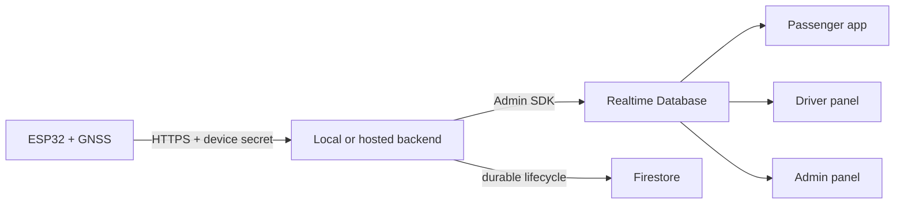

# Eki live bus tracking

Eki is a GNSS-based university bus tracker with passenger, driver, and admin
web apps. An ESP32 sends a closed six-field telemetry payload to the backend
over certificate-verified HTTPS. The backend owns routing identity, trip
lifecycle, stop order, and all Firebase writes.

## Runtime flow


```mermaid
flowchart LR
  ESP["ESP32 + GNSS"] -->|"HTTPS + device secret"| API["Local or hosted backend"]
  API -->|"Admin SDK"| RTDB["Realtime Database"]
  API -->|"durable lifecycle"| FS["Firestore"]
  RTDB --> P["Passenger app"]
  RTDB --> D["Driver panel"]
  RTDB --> A["Admin panel"]
```

The driver arms an assigned bus and route. The ride becomes `in_service` only
when authenticated GNSS reaches stop 1, advances through stops strictly in
order, and becomes `completed` only at the final stop. Power, Wi-Fi, GNSS, page
refresh, and backend restarts do not complete an active ride.

## Local setup

Requirements: Node.js 20+, Firebase, Google Maps browser/server keys, and
PlatformIO for firmware.

```bash
npm install
Copy-Item backend/.env.example backend/.env
Copy-Item frontend/env.production.example frontend/.env.local
npm run dev
```

- Frontend: `http://localhost:3000`
- Backend: `http://localhost:4000`
- Backend health: `http://localhost:4000/health`

The ESP requires a public or LAN-reachable **HTTPS** URL; `localhost` on the
ESP refers to the ESP, not the laptop. See
[Live demo runbook](docs/LIVE_DEMO_RUNBOOK.md).

## Verification

```bash
npm run verify
platformio run --project-dir hardware
```

## Essential documentation

- [Architecture and lifecycle](docs/ARCHITECTURE.md)
- [Student live-demo runbook](docs/LIVE_DEMO_RUNBOOK.md)
- [University handover checklist](docs/UNIVERSITY_DEPLOYMENT_CHECKLIST.md)
- [Storage architecture](docs/STORAGE_ARCHITECTURE.md)
- [Backend API](backend/API.md)
- [Hardware build](hardware/README.md)
