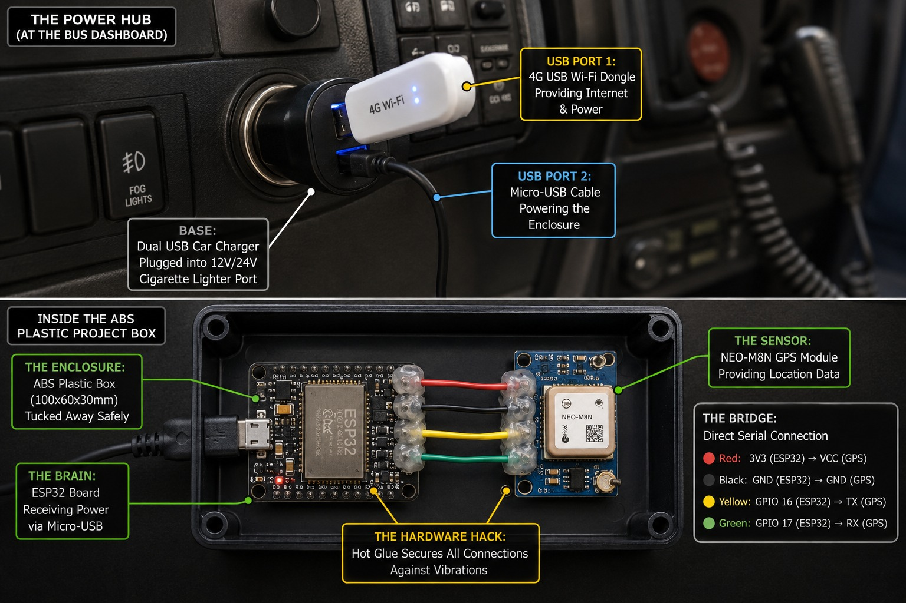
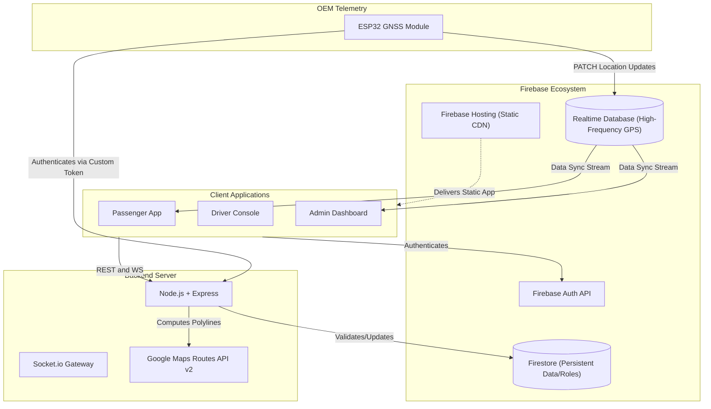

# Eki — Open-Source GPS & Vehicle Tracking System


> An open-source, full-stack vehicle tracking ecosystem designed to operate within **Firebase free-tier limits** for small-to-medium fleets. Build your own live GPS tracker using an ESP32 and NEO-M8N GNSS module, streaming location updates to Firebase RTDB with Next.js live-map dashboards. Note: larger deployments (50+ buses, 200+ concurrent listeners) may exceed free-tier capacity.



---

## Overview

Eki (BusTrackr) is a full-stack, real-time fleet management ecosystem. By bridging custom OEM hardware telemetry (ESP32) directly to a Firebase real-time streaming layer and serving it through a Next.js App Router stack, it completely eliminates manual driver interaction for location updates while providing sub-second latency for commuters.

The system is composed of three primary surfaces:

1. **Passenger App**: Interactive live maps, adaptive-update ETA calculations (2–10 second update cadence), and dynamic live announcements.
2. **Admin Dashboard**: Bird's-eye fleet map, historical analytics, route infrastructure management, and passenger communication overrides.
3. **Hardware Telemetry**: Dedicated ESP32 GNSS modules physically installed on buses, autonomously streaming location data using smart-delta transmission.

---

## System Architecture

Eki utilizes a highly optimized real-time architecture, maximizing Google Cloud and Firebase free tiers.

- **Hardware Telemetry (ESP-WROOM-32 & NEO-M8N):** Processes NMEA sentences via TinyGPS++ to extract live coordinates, speed, and heading.
- **Cost-Optimized Sync:** Smart delta-transmission firmware calculates Haversine distance locally. It only sends HTTPS PATCH updates to Firebase RTDB when the vehicle moves >10m or turns >15°, reducing cloud writes by ~85%.
- **Immutable Custom Claims & Role-Based Access Control:** Next.js presentation boundaries and Firebase Security Rules enforce immutable `auth.token.role` claims issued via backend synchronization (`npm run sync-role-claims`).
- **Mobile-First Deferred Map Loading:** Google Maps SDK loading is completely deferred from root and layout levels, dynamically mounting via `PassengerTrackingMap` only when a rider opens live tracking.
- **Client Real-Time Singletons:** Global Module-Level Singletons heavily optimize Firestore snapshot listeners and RTDB listeners, ensuring that no matter how many React components mount, exactly 1 WebSocket connection is used per client.


```mermaid
graph TD
    subgraph Hardware [OEM Telemetry]
        ESP[ESP32 GNSS Module]
    end

    subgraph Firebase Ecosystem
        Auth["Firebase Auth API"]
        RTDB[("Realtime Database (High-Frequency GPS)")]
        FS[("Firestore (Persistent Data/Roles)")]
        Hosting["Firebase Hosting (Static CDN)"]
    end

    subgraph Cloud Container [Backend Server]
        Express["Node.js + Express"]
        SocketIO["Socket.io Gateway"]
        RoutesAPI["Google Maps Routes API v2"]
    end

    subgraph Frontend [Client Applications]
        P["Passenger App"]
        D["Driver Console"]
        A["Admin Dashboard"]
    end

    %% Hardware Flow
    ESP -->|Authenticates via Custom Token| Express
    ESP -->|PATCH Location Updates| RTDB

    %% Web connections
    Hosting -.->|Delivers Static App| Frontend
    Frontend -->|Authenticates| Auth
    
    %% Realtime Connections
    RTDB -->|Data Sync Stream| P
    RTDB -->|Data Sync Stream| A

    %% Backend Connections
    Frontend -->|REST and WS| Express
    Express -->|Validates/Updates| FS
    Express -->|Computes Polylines| RoutesAPI
```

---

## Tech Stack

| Layer | Technologies Used |
| --- | --- |
| **Frontend** | Next.js 16 (App Router), React 19, TypeScript, Tailwind CSS, Google Maps (@vis.gl) |
| **Backend** | Node.js, Express 4, Socket.io 4, TypeScript, Docker |
| **Hardware** | ESP-WROOM-32, NEO-M8N GNSS, PlatformIO, ArduinoJson |
| **Data & Auth** | Firestore, Firebase Realtime Database, Firebase Auth, Firebase Hosting |
| **Maps & GIS** | Google Maps JS API (Client), Routes API v2 (Server) |

---

## Repository Structure

This repository is structured as a monorepo, separating the distinct operational domains of the ecosystem.

```text
Eki/
├── backend/       # Node.js server (WebSocket gateway, Routes API, secure ops)
├── docs/          # Deep-dive architecture, zero-budget optimizations, and hardware
├── frontend/      # Next.js web applications (Passenger, Driver, Admin portals)
├── hardware/      # PlatformIO/C++ firmware for ESP32 GNSS telemetry modules
└── scripts/       # Repository-wide utility and build scripts
```

---

## Prerequisites & Installation

To run this ecosystem locally, you will need:

- **Node.js** ≥ 20.x
- **PlatformIO** (if compiling hardware firmware)
- A **Google Cloud Project** with Maps JavaScript API and Routes API v2 enabled.
- A **Firebase Project** with Authentication, Firestore, and Realtime Database initialized.

### 1. Clone & Install

```bash
git clone https://github.com/AryanPatelOnGIT/Bus_Track.git
cd Bus_Track
npm install
```

### 2. Environment Configuration

You must configure environment variables for both the backend and frontend.

**Backend (`backend/.env`):**
Requires your Firebase Admin Service Account JSON and a Google Maps Server Key (IP Restricted).

```bash
cp backend/.env.example backend/.env
# Edit backend/.env with your credentials
```

**Frontend (`frontend/.env.local`):**
Requires your Firebase public config and a Google Maps Browser Key (HTTP Referrer Restricted).

```env
NEXT_PUBLIC_FIREBASE_API_KEY=your_public_key
NEXT_PUBLIC_GOOGLE_MAPS_KEY=your_browser_key
# ... see frontend/README.md for full list
```

---

## Running the Application

### Development Mode

You can spin up both the Next.js frontend and the Express backend concurrently from the root directory:

```bash
npm run dev
```

- **Frontend:** [http://localhost:3000](http://localhost:3000)
- **Backend:** [http://localhost:4000](http://localhost:4000)

### Production Build & PWA Auto-Update

To create a production-optimized static export of the frontend and deploy to Firebase Hosting:

```bash
npm run deploy
```
*Note: The frontend leverages an advanced `version.json` cache-busting strategy, ensuring users with aggressive Safari caches immediately auto-refresh when new deployments hit production.*

---

## Documentation Index

For super-detailed explanations of the system architecture, zero-budget scaling, and hardware integration, please refer to our deep-dive documentation:

- [Master Project Scrum Board](docs/SCRUM_BOARD.md) **(NEW)**
- [System Architecture & RBAC Flow](docs/ARCHITECTURE.md) **(Updated)**
- [Zero-Budget & API Optimizations](docs/OPTIMIZATIONS.md) **(NEW)**
- [GNSS Hardware Migration Guide](docs/GNSS_HARDWARE_MIGRATION.md)
- [System Workflows](docs/WORKFLOW_EXPLANATION.md)
- [PWA Update Strategy](docs/PWA_UPDATE_STRATEGY.md)
- [Hardware Telemetry & Security](hardware/README.md)
- [Frontend Workspace](frontend/README.md)
- [Backend Workspace](backend/README.md)
