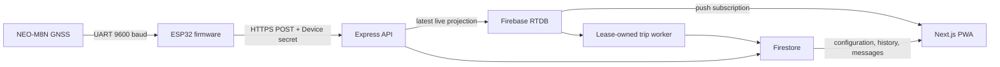
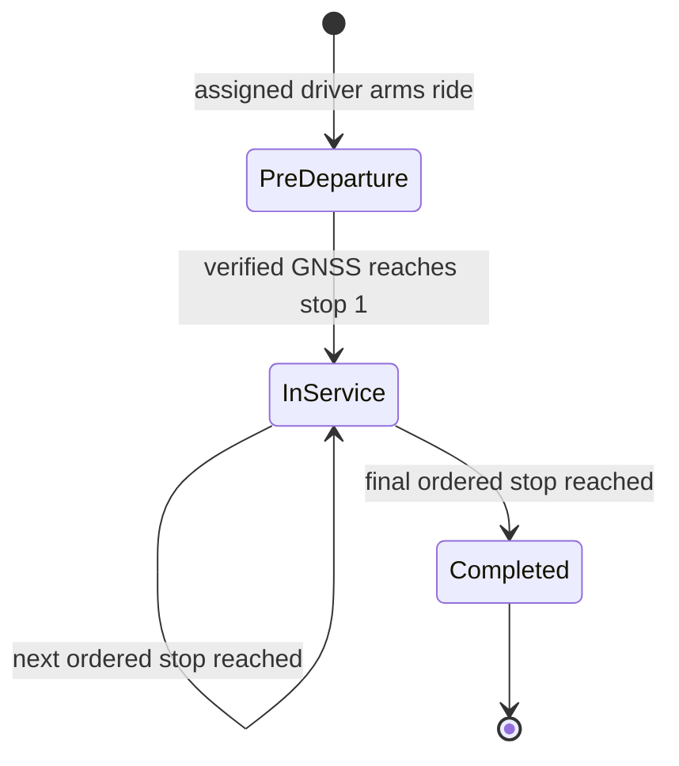

# Eki campus bus tracking

Eki is a single-university bus-tracking system. An ESP32 reads a NEO-M8N GNSS receiver and pushes validated fixes over HTTPS to an Express backend. The backend owns identity and trip progression, projects current state to Firebase Realtime Database (RTDB), and persists configuration/recovery/history in Firestore. A static Next.js PWA provides passenger and administrator workspaces; administrators perform ride operations for assigned fleet operators.

## How it works


```mermaid
flowchart LR
  GNSS["NEO-M8N GNSS"] -->|"UART 9600 baud"| ESP["ESP32 firmware"]
  ESP -->|"HTTPS POST + Device secret"| API["Express API"]
  API -->|"latest live projection"| RTDB["Firebase RTDB"]
  RTDB -->|"push subscription"| WEB["Next.js PWA"]
  RTDB --> WORKER["Lease-owned trip worker"]
  API --> FS["Firestore"]
  WORKER --> FS
  FS -->|"configuration, history, messages"| WEB
```

There is no browser or hardware write path to live bus state. The hardware knows only its device ID, secret, backend URL, CA certificate, and Wi-Fi credentials. The protected `devices` record supplies its bus/route assignment.

Live web data is not API-polled. Firebase `onValue` (RTDB) and `onSnapshot` (Firestore) push changes; normal REST commands use the browser `fetch` API. `fetch` is an HTTP client API, while polling is a repeated-request strategy that can itself use `fetch`, so replacing “polling with fetch” is not a meaningful architectural change.

## Ride lifecycle


```mermaid
stateDiagram-v2
  [*] --> PreDeparture: assigned driver arms ride
  PreDeparture --> InService: verified GNSS reaches stop 1
  InService --> InService: next ordered stop reached
  InService --> Completed: final ordered stop reached
  Completed --> [*]
```

- Arming requires a fresh hardware fix and a valid driver/bus/route assignment.
- A durable `_active_bus_locks/{busId}` record prevents one bus from running two route sessions at once.
- Only the next configured stop advances progress. Segment crossing handles movement between samples.
- GNSS, Wi-Fi, hardware, browser, or backend interruption does not discard the durable `active_rides` state.
- Final-stop completion atomically writes history and conditionally releases the active ride and bus lock.

## Repository map

| Path | Responsibility |
|---|---|
| `backend/src/server.ts` | Express composition, middleware, health probe, shutdown |
| `backend/src/routes/` | Authenticated browser/device HTTP boundaries |
| `backend/src/services/` | Telemetry, lifecycle, worker lease, recovery, privacy, retention |
| `backend/src/lib/` | Firebase Admin, geography, Maps, polyline/segment math |
| `frontend/src/app/` | Landing and role-protected App Router workspaces |
| `frontend/src/components/` | Admin operations, passenger tracking, maps, shared dialogs/messaging |
| `frontend/src/hooks/` | Auth, shared Firestore/RTDB subscriptions, motion/focus behavior |
| `frontend/src/lib/` | Firebase clients and pure live-data/map/history helpers |
| `frontend/src/sw.js` | Static/public caching; authenticated and unknown requests are network-only |
| `hardware/src/main.cpp` | GNSS parsing, HTTPS transport, buffering, watchdog and device loop |
| `hardware/include/telemetry_policy.h` | Host-testable motion, distance, publish and retry policy |
| `firestore.rules` / `database.rules.json` | Client authorization; Admin SDK bypasses rules |
| `scripts/` | Production build, Workbox generation, deterministic CSP hashes |
| `docs/` | HLD, LLD, data dictionary, telemetry, tests, audit, operations |

The detailed file-by-file module catalog is in [Low-level design](docs/design/LOW_LEVEL_DESIGN.md).

## Local setup

Requirements: Node.js 20+, npm 10+, Firebase project, browser/server Google Maps keys, and PlatformIO for firmware work.

```powershell
npm install
Copy-Item backend/.env.example backend/.env
Copy-Item frontend/env.production.example frontend/.env.local
npm run dev
```

Backend credentials can be `FIREBASE_SERVICE_ACCOUNT` JSON or Application Default Credentials. `FIREBASE_DATABASE_URL` is required in production. The frontend template contains every mandatory public production variable; `npm run build:production` fails if one is absent or if a backend/database URL is local or non-HTTPS.

Create routes/fleet records before provisioning a tracker:

```powershell
npm run provision-device --workspace=backend -- `
  --device-id device_01 --bus-id bus_01 --route-id route_01
```

The command prints the random device secret once and stores only a salted scrypt verifier. In the controlled firmware-signing environment, place that plaintext with Wi-Fi, backend origin, and CA in the ignored `hardware/include/secrets.h`, then build and flash the device-specific image. The firmware has no local configuration portal or application credential store; every change requires a reflash. Fleet artifacts use the Secure Boot V2/flash-encrypted `esp32dev-secure` environment and the witnessed [hardware security procedure](docs/operations/HARDWARE_SECURITY_PROVISIONING.md).

## Hardware contract

`POST /api/devices/:deviceId/telemetry`

```http
Authorization: Device <secret>
Content-Type: application/json
```

```json
{
  "lat": 23.034,
  "lng": 72.55,
  "speed": 18.2,
  "heading": 94,
  "motionState": "moving",
  "timestamp": <current Unix epoch in milliseconds>
}
```

Generate the timestamp immediately before sending (for example, `Date.now()`); it must be a current Unix epoch value in milliseconds. The JSON is limited to 512 bytes and exactly six fields. Coordinates, speed (0–200 km/h), heading (0–360), motion state, and timestamp freshness are checked. `202` accepts a new fix; `200` acknowledges a duplicate; `400`, `401`, `413`, `429`, and `503` indicate payload, credential, body-size, rate, and service failures.

Firmware uses NTP/GNSS time for TLS/time stamps, an 8 KiB UART RX buffer, HDOP ≤ 4, motion hysteresis, a 3-second change floor, 30-second moving heartbeat, 60-second stopped heartbeat, 7-second HTTP timeout, capped jittered retry, and a 25-second watchdog. An authenticated 1 KiB diagnostics channel reports bounded device health and hardware-security state every five minutes without credentials. See [Hardware telemetry](docs/hardware/HARDWARE_TELEMETRY.md).

## Verification

```powershell
npm run verify
& "$env:USERPROFILE\.platformio\penv\Scripts\platformio.exe" run -d hardware
```

`npm run verify` runs both linters, all software tests, TypeScript/build/static export, service-worker injection, CSP regeneration, and the production dependency audit. Firebase rule emulator cases require Java and emulator configuration. Physical GNSS/TLS/radio/vehicle behavior still requires the runbook tests.

## Documentation

- [Documentation index](docs/index/README.md)
- [Getting started and operating guide](docs/GETTING_STARTED.md)
- [Environment and configuration reference](docs/CONFIGURATION.md)
- [High-level design](docs/design/HIGH_LEVEL_DESIGN.md)
- [Low-level design and module catalog](docs/design/LOW_LEVEL_DESIGN.md)
- [Firestore and RTDB data dictionary](docs/data/FIREBASE_DATA_MODEL.md)
- [Hardware setup and route-specific flashing](hardware/README.md)
- [Hardware telemetry and latency/failure analysis](docs/hardware/HARDWARE_TELEMETRY.md)
- [Backend API](backend/API.md)
- [Test strategy and failure matrix](docs/testing/TEST_STRATEGY.md)
- [Production readiness audit](docs/operations/PRODUCTION_READINESS_AUDIT.md)
- [Live demo runbook](docs/operations/LIVE_DEMO_RUNBOOK.md)
- [University deployment checklist](docs/operations/UNIVERSITY_DEPLOYMENT_CHECKLIST.md)
- [CI, deployment, and release guide](docs/operations/CI_CD_AND_RELEASES.md)
- [ESP32 fleet security and provisioning](docs/operations/HARDWARE_SECURITY_PROVISIONING.md)
- [Security policy](SECURITY.md)

## Production boundary

The repository is production-oriented but cannot configure university-owned infrastructure or prove physical behavior. Production owners must provide managed TLS/DNS, WAF/global rate limits, monitoring/alerts, backups, key restrictions, App Check enforcement, separate staging/production projects, privacy approval, signed OTA/rollback, controlled signing-key custody, physical Secure Boot V2/flash-encryption acceptance on spare boards, automotive power protection, and an observed route acceptance test.

## License

Copyright (c) 2026 Eki Bus Tracking Project. Licensed under the MIT License.
