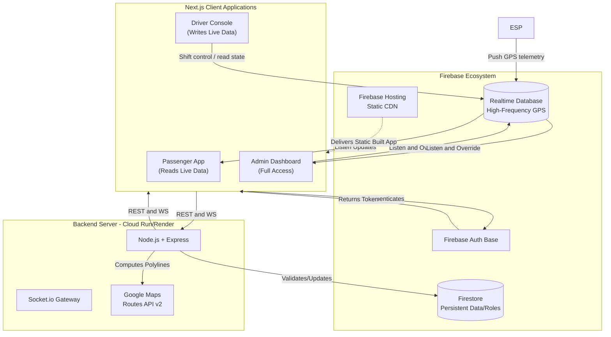
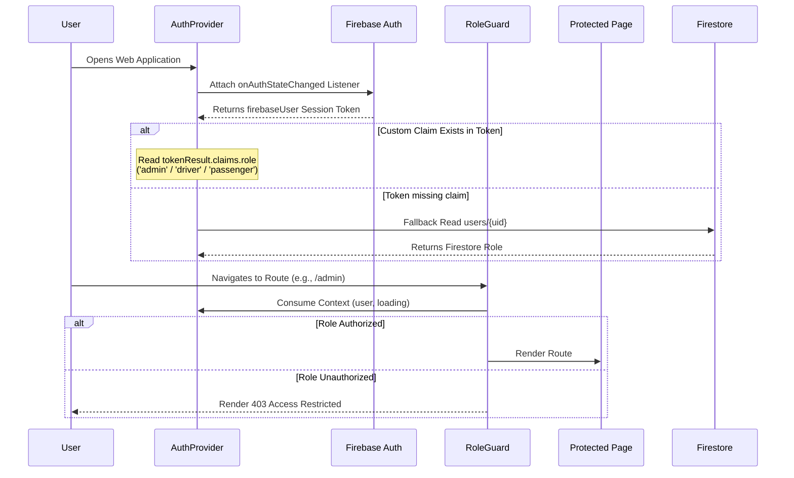
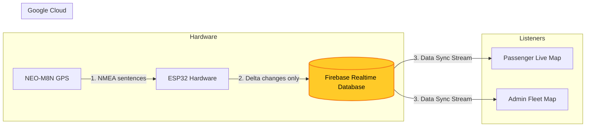
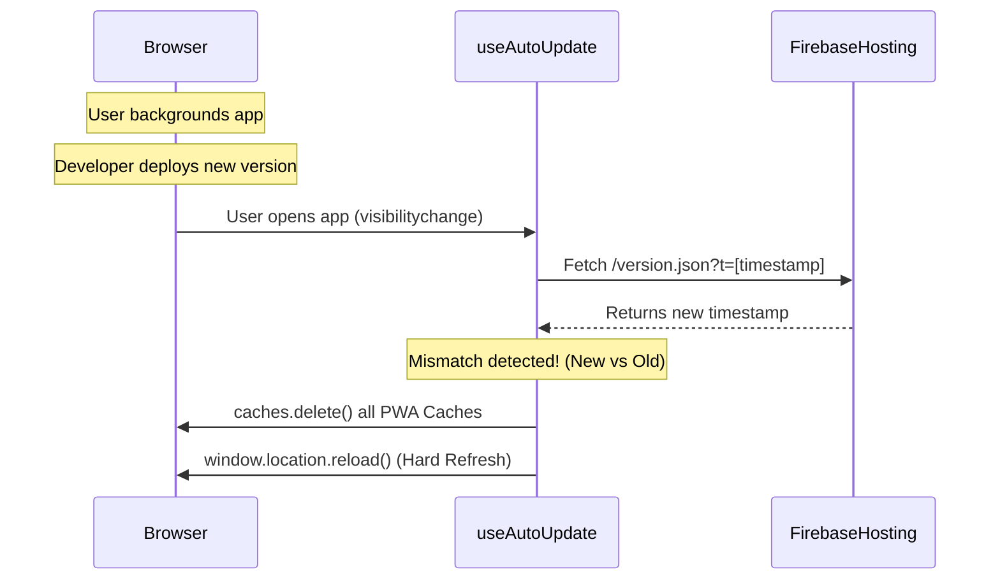

# Eki Architecture & Data Flow

This document details the core architecture, data synchronization flows, and Role-Based Access Control (RBAC) hierarchy of the Eki ecosystem.

## 1. High-Level Architecture

Eki uses a modern hybrid, real-time architecture leveraging Firebase as the core streaming layer, a containerized Node.js backend for heavy computation, and an ESP32 hardware telemetry edge layer.

## 2. Role-Based Access Control (RBAC) & Custom Claims Architecture

The system employs a strict hierarchical Role-Based Access Control pattern backed by immutable **Firebase Custom Claims** (`auth.token.role`).

### 2.1 Custom Claims Authorization Model
Unlike legacy client-writable database roles, role authorization in Eki is issued server-side by an admin synchronization task (`npm run sync-role-claims`) using the Firebase Admin SDK:
* **Admin:** Issued `role: "admin"` and `admin: true` claims. Access to `/admin`, `/driver`, and `/passenger`.
* **Driver:** Issued `role: "driver"` claim. Access to `/driver` and `/passenger`.
* **Passenger:** Issued `role: "passenger"` claim (or default). Access to `/passenger`.
* **Device:** Hardware units are issued temporary custom tokens containing `role: "device"` and `deviceId: "<hardwareId>"`.

The synchronization task also mirrors each driver's assigned bus routes into a
server-only RTDB path. RTDB rules use that mirror to prevent a valid driver
from publishing their assigned bus on an unassigned route. Run the task after
changing a driver, a driver's bus, or a bus's route assignment.

### 2.2 Global AuthProvider Singleton
The frontend uses a top-level `<AuthProvider>` in `Providers.tsx` ([useAuth.ts](../frontend/src/hooks/useAuth.ts)) that maintains a single `onAuthStateChanged` listener across all route changes:
1. On initial mount or page refresh, `useAuth` inspects `firebaseUser.getIdTokenResult().claims.role`.
2. If custom claims exist in the active session token, the role is immediately initialized without waiting for a Firestore read.
3. If no custom claim is present (new or legacy users), it falls back to a single read of `users/{uid}` in Firestore.

### 2.3 Presentation vs Enforcement Boundaries
* **Presentation Layer:** `RoleGuard.tsx` checks the authenticated user's role and renders UI or a 403 fallback.
* **Database Security Layer:** Firebase Realtime Database rules (`database.rules.json`) strictly evaluate `auth.token.role` and `auth.token.deviceId`:
  - Client writes to `/users/$uid` are disabled (`.write: false`).
  - Active bus writes under `/activeBuses/$busKey` require `auth.token.role === 'driver' | 'admin'` or a path-isolated hardware token matching `auth.token.deviceId`.
  - Chat messages under `/messages` are append-only (`!data.exists()`) with strict schema and sender verification.

## 3. Real-Time GPS Tracking Data Flow

Location updates happen completely outside the standard Node.js server. The ESP32 hardware modules physically on the buses stream directly to the Firebase Realtime Database (RTDB) using an adaptive transmission cadence of 2–10 seconds (or a 30-second stationary heartbeat). RTDB then broadcasts updates to the Passenger app.

### 3.1 Client-Side ETA Mathematics
If a bus loses GPS signal or stops transmitting, the client does not wait helplessly. The architecture gracefully falls back to a **35km/h internal estimation math** (matching 4-wheeler transit speeds) overlaid onto the Haversine distance remaining to the next stop. This guarantees that passengers always see a highly accurate, speed-aware ETA projection even when GNSS hardware briefly fails.

### 3.2 Custom Map Overlays (Semantic UI)
To prevent native Google Maps controls from interfering with our highly styled floating action buttons (FABs), we explicitly pass `options={{ disableDefaultUI: true }}` to the `@vis.gl` wrapper. We then implement our own semantic layers (e.g. `LocateFixed`/`Navigation` buttons tracking the active bus or passenger, `MessageCircle` for live chat).

## 4. Admin Panel Rewrite Architecture

The Admin Panel has been rebuilt into a unified 5-tab interface (`Dashboard`, `Routes`, `Fleet`, `Personnel`, `Settings`). 

To avoid the cost of opening 5 different WebSocket listeners to Firebase RTDB/Firestore, the admin panel architecture heavily relies on conditionally mounted tabs using `&&` and isolated Context boundaries.

* **Layout Client Boundary:** `layout.tsx` is `"use client"` so it can wrap all panels in `RoleGuard` and `MapProviders`.
* **Shared Firebase Connections:** Instead of using React Context for Firebase RTDB, tabs only mount when active, guaranteeing that `DashboardPanel` and `FleetManagementPanel` never accidentally double-subscribe to Firebase at the same time.
* **Singleton `useSettings`:** For Firestore globals, `useSettings.ts` sits at the module level. Even if 10 components on the page consume settings, exactly 1 Firestore `onSnapshot` is spawned.

## 5. PWA Auto-Update Strategy

To ensure zero downtime and instant rollouts across PWAs and aggressive Safari caches, Eki implements a strict auto-polling strategy.

## 6. Backend Dockerization

The Node.js backend (located in the `/backend` directory) includes a `Dockerfile`. While Firebase (RTDB & Firestore) efficiently handles direct client-to-database real-time streaming, the Dockerized Node.js backend securely manages:

* **Heavy Computation:** Interacting with the Google Maps Routes API v2 to compute complex polylines and ETAs (Cost optimization).
* **Security & Validation:** Hiding sensitive Server API keys and enforcing complex business logic.
* **WebSocket Management:** Running a Socket.io gateway for older legacy interactions.
