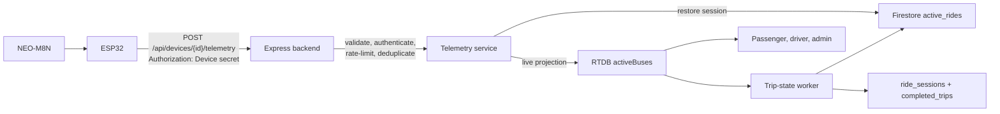
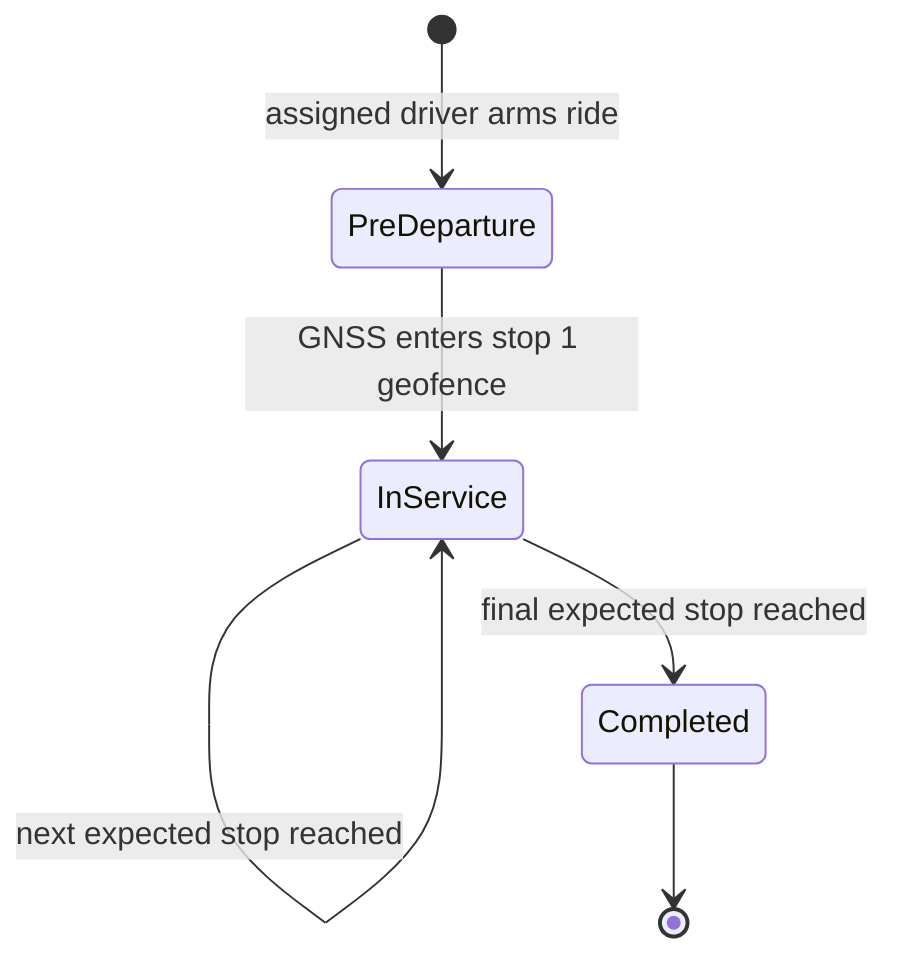

# Architecture and trip lifecycle

## Decision

Hardware telemetry uses HTTPS directly to the backend. There is no message
broker or direct device access to Firebase.



This keeps the demo simple while preserving the important boundary: the ESP
knows only its own device ID, secret, backend URL, and TLS root certificate.
Bus and route identity come from the protected server-side device registry.

## Telemetry contract

The request body must be JSON of at most 512 bytes containing exactly:

```json
{
  "lat": 23.034,
  "lng": 72.55,
  "speed": 18.2,
  "heading": 94.0,
  "motionState": "moving",
  "timestamp": 1800000000000
}
```

The backend rejects extra/missing fields, invalid coordinates, speeds above
200 km/h, invalid headings, stale/future timestamps, duplicate timestamps,
disabled devices, invalid assignments, bad credentials, and excess traffic.
Secrets are stored as salted scrypt verifiers and never returned to clients.

## Authoritative lifecycle



- Arming requires a fresh hardware GNSS fix, but may happen before the bus
  reaches the first boarding stop.
- Only the next expected stop can advance progress. A later stop cannot skip an
  earlier one.
- Stop crossing between two nearby fixes is accepted, preventing a fast bus
  from missing a small geofence.
- GNSS loss sets signal state to lost; it does not change trip lifecycle.
- Driver and admin interfaces cannot edit GNSS position, stop index, trip
  state, or manually end an active ride.

## Interruption recovery

`active_rides/{busId_routeId}` is the canonical durable recovery record.
`activeBuses/{busId_routeId}` is the low-latency public live projection.

If ESP power/Wi-Fi/GNSS stops, the live record remains active and is marked
offline after the stale threshold. Passenger, driver, and admin panels retain
the ride and show signal interruption. When the ESP reconnects, the backend
restores the same session and stop index before processing subsequent ordered
stops. The worker uses a Firestore lease so only one backend instance owns trip
state, ETA, cleanup, and retention work.

## Latency and cost

- ESP publish gate: 3 seconds while moving; 30-second moving heartbeat;
  60-second stationary heartbeat.
- HTTPS credential checks use a bounded 60-second digest cache after the first
  scrypt verification.
- RTDB provides push updates to web apps; one shared listener per browser
  avoids duplicate streams.
- Client map motion is smoothed without delaying authoritative updates.
- ETA refresh is separately bounded by `ETA_INTERVAL_MS` because Routes API
  calls cost money; location updates do not wait for ETA recomputation.

Actual latency still depends on mobile data, HTTPS endpoint distance, Firebase
region, browser connection, and GNSS sky visibility. It must be measured on the
real bus route before acceptance.

## Security boundaries

- TLS certificate verification is mandatory in firmware; insecure TLS is not
  supported.
- Firebase RTDB telemetry is client-read/server-write.
- `devices` and `active_rides` are inaccessible to browser clients.
- Browser REST calls use Firebase ID tokens and role/assignment checks.
- Device credentials are independent from Firebase and scoped by the
  server-side device-to-bus/route binding.
- Production must add edge rate limiting, secret management, monitoring,
  backups, and physical ESP32 secure boot/flash encryption.
