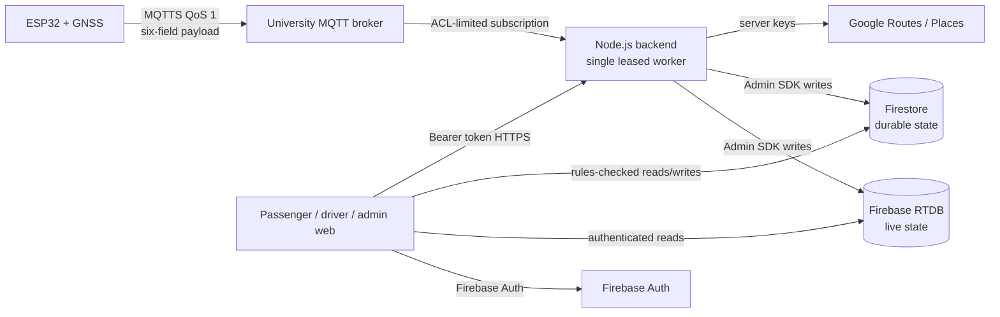

# Eki architecture

## Trust boundaries

Devices never receive Firebase credentials. RTDB is client-read and
server-write. Browser lifecycle, fleet, route, delay, and override mutations
cross authenticated backend endpoints. Firestore rules permit only the narrow
passenger manifest, feedback, settings, and transactional chat operations that
are explicitly defined.

## MQTT telemetry contract

- Topic: `eki/v1/telemetry/<deviceId>`
- Transport: TLS on port 8883; plaintext MQTT is rejected in production.
- Delivery: QoS 1, non-retained.
- Payload keys, exactly:
  `lat`, `lng`, `speed`, `heading`, `motionState`, `timestamp`.
- Device identity, bus identity, and route identity are not accepted from the
  JSON payload. The broker ACL fixes the device identity in the topic and the
  backend resolves bus/route from the server-side `devices` registry.
- The backend rejects malformed, oversized, extra-field, out-of-range, stale,
  future, retained, non-QoS-1, disabled, misassigned, duplicate, and
  over-budget messages.
- QoS 1 is at-least-once. Timestamp comparison plus an RTDB transaction makes
  duplicate delivery idempotent.

## Live-state lifecycle

The MQTT ingestor updates only the six telemetry values plus server-owned
identity/presence. Shift start requires a GNSS timestamp no older than 60
seconds and a position within 250 metres of the route origin. The backend owns
`sessionId`, driver identity, trip state, stop index, delay, ETAs, completion,
and offline retirement.

The trip-state engine and MQTT consumer run only on the instance holding the
Firestore `_worker_leases/telemetry-trip-state-worker` lease. Losing the lease
stops listeners, timers, telemetry consumption, reconciliation, and retention
work before another instance takes over.

## Abuse and cost controls

- MQTT broker credentials and ACLs isolate each device topic.
- MQTT packets are capped at 512 payload bytes and 30 accepted messages per
  device per minute by default.
- QoS duplicates are discarded before consuming a rate-budget slot.
- HTTP has global, write, route-computation, and route-planning limits plus
  body/header/request/keep-alive bounds.
- Health checks use cached Firebase state and do not amplify requests into
  database reads.
- Route documents and decoded geometry are bounded and cached.
- Browser Firestore snapshots and message history have explicit limits.
- Passenger map and home share one normalized RTDB listener.
- A university reverse proxy/WAF and shared edge rate limiting remain required
  because application HTTP limiters are process-local.

## Privacy and retention

The leased worker recursively deletes completed/failed ride sessions after 90
days, feedback and completed-trip records after 180 days, and fleet operation
logs after 90 days by default. These values are configurable and must be
approved by university privacy/legal owners before beta data collection.

Backups, point-in-time recovery, restore drills, budget alerts, App Check
enforcement, API-key restrictions, and incident response are infrastructure
controls and are listed in
`docs/MQTT_DEPLOYMENT_AND_OWNER_CHECKLIST.md`.
