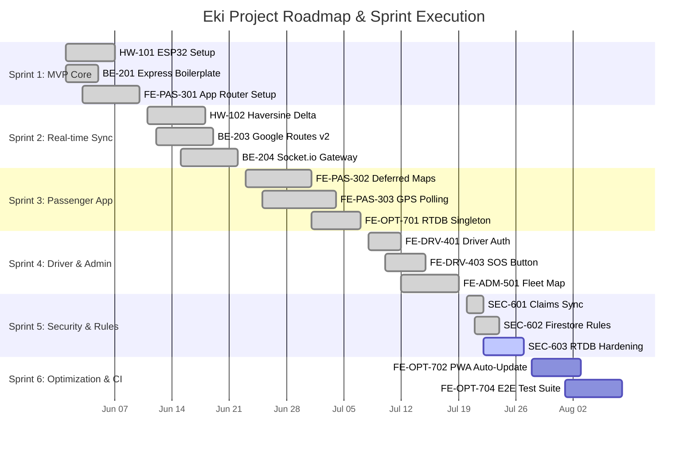

# Eki (BusTrackr) — Project Master Scrum Board

> Comprehensive agile project management board covering all domains of the Eki vehicle tracking system: Hardware Telemetry, Real-time Backend Server, Passenger Web Portal, Driver Console, Admin Dashboard, Firebase RBAC & Security, and Zero-Budget Cloud Optimizations.

---

## 📊 Executive Summary & Velocity Overview

- **Total Epics**: 7 Major Domains
- **Total Sprints**: 6 Sprints + Product Backlog
- **Total Story Points**: 194 Points
- **Completed Points**: 128 Points (66% Progress)
- **Active Sprint**: Sprint 5 (Security Hardening & Live Analytics)

### Sprint Cadence & Allocation
| Sprint | Focus Area | Planned Points | Status |
| :--- | :--- | :---: | :---: |
| **Sprint 1** | Core Architecture & Hardware MVP | 34 pts | **Completed** |
| **Sprint 2** | Real-time Firebase Sync & Routes API | 32 pts | **Completed** |
| **Sprint 3** | Passenger App & Deferred Maps | 35 pts | **Completed** |
| **Sprint 4** | Driver Console & Admin Management | 27 pts | **Completed** |
| **Sprint 5** | RBAC, Claims & Security Hardening | 28 pts | **IN PROGRESS** |
| **Sprint 6** | Zero-Budget Scaling, PWA & Audit | 22 pts | **Planned** |
| **Backlog** | Future Enhancements & Integration | 16 pts | **Backlog** |

---

## 🎯 Epics Overview

1. **EPIC-1: Hardware Telemetry & Firmware (`HW`)** — ESP32, NEO-M8N GNSS module, NMEA parsing, Haversine delta filtering, HTTPS RTDB updates.
2. **EPIC-2: Real-time Backend & Gateway (`BE`)** — Express 4 server, Socket.io gateway, Google Maps Routes API v2, custom token minting.
3. **EPIC-3: Passenger Portal & Rider UX (`FE-PAS`)** — Next.js App Router, live tracking, deferred Google Maps JS SDK, adaptive 2–10s polling, announcement banner.
4. **EPIC-4: Driver Console & Standby Telemetry (`FE-DRV`)** — Driver auth, trip toggle, emergency alert button, fallback browser Geolocation API.
5. **EPIC-5: Admin Fleet Management (`FE-ADM`)** — Fleet overview map, CRUD routes & stops, driver assignment, passenger broadcast center, health telemetry.
6. **EPIC-6: Security, Auth & RBAC (`SEC`)** — Firebase Custom Claims (`admin`, `driver`, `passenger`), Firestore & RTDB Security Rules, token verification.
7. **EPIC-7: Zero-Budget Optimization & DevOps (`OPT`)** — Haversine delta transmitter (-85% writes), RTDB singletons, service worker cache-busting, deployment automation.

---

## 🚀 Sprint Board Breakdown

### Column Statuses:
- `[DONE]` Completed & verified
- `[IN REVIEW]` Pull request submitted / undergoing validation
- `[IN PROGRESS]` Currently being worked on
- `[TO DO]` Queued for execution in active sprint
- `[BACKLOG]` Future roadmap item

---

## 📋 Detailed Task Index

### ⚡ EPIC 1: Hardware Telemetry & Firmware (ESP32 / PlatformIO)

#### `HW-101`: ESP32 & NEO-M8N Hardware Wiring & PlatformIO Setup
- **Status**: `[DONE]`
- **Sprint**: Sprint 1 | **Priority**: `P0 Critical` | **Estimate**: `5 pts`
- **Assignee**: Hardware Firmware Engineer
- **Description**: Configure PlatformIO environment for ESP-WROOM-32, initialize UART interface for NEO-M8N GNSS module, and set up hardware baud rates (9600 baud).
- **Acceptance Criteria**:
  - [x] PlatformIO project builds without compilation warnings.
  - [x] Hardware serial reads valid NMEA sentences `$GPRMC` and `$GGGA` from GNSS chip.
  - [x] Status LED blinks upon successful GPS fix.

#### `HW-102`: Smart Delta-Transmission Haversine Filtering Firmware
- **Status**: `[DONE]`
- **Sprint**: Sprint 1 | **Priority**: `P0 Critical` | **Estimate**: `8 pts`
- **Assignee**: Hardware Firmware Engineer
- **Description**: Implement local C++ Haversine distance and bearing calculation to limit telemetry transmissions to movements >10m or heading turns >15°.
- **Acceptance Criteria**:
  - [x] Calculates Haversine distance accurately between consecutive fixes.
  - [x] Suppresses RTDB PATCH requests when stationary (reduces database writes by ~85%).
  - [x] Forces heartbeat update every 60 seconds even when stationary.

#### `HW-103`: Firebase Realtime Database HTTPS PATCH Client
- **Status**: `[DONE]`
- **Sprint**: Sprint 2 | **Priority**: `P0 Critical` | **Estimate**: `5 pts`
- **Assignee**: Hardware Firmware Engineer
- **Description**: Develop lightweight HTTP REST client using `WiFiClientSecure` to send PATCH payload directly to Firebase RTDB `/vehicles/{busId}/location.json`.
- **Acceptance Criteria**:
  - [x] SSL fingerprint / root CA certificate validation for Firebase endpoint.
  - [x] Sends JSON payload containing `lat`, `lng`, `speed`, `heading`, and `timestamp`.
  - [x] Handles WiFi reconnection automatically with exponential backoff.

#### `HW-104`: Hardware Power Failure Queueing & Offline Buffer
- **Status**: `[DONE]`
- **Sprint**: Sprint 2 | **Priority**: `P1 High` | **Estimate**: `8 pts`
- **Assignee**: Hardware Firmware Engineer
- **Description**: Store un-transmitted GPS points in ESP32 SPIFFS/LittleFS filesystem flash memory when cellular/WiFi connectivity drops.
- **Acceptance Criteria**:
  - [x] Buffers up to 500 telemetry points when network connection is offline.
  - [x] Automatically flushes queue sequentially upon connection restoration.
  - [x] Flash wear-leveling algorithm prevents flash memory degradation.

#### `HW-105`: ESP32 Over-The-Air (OTA) Firmware Update Pipeline
- **Status**: `[BACKLOG]`
- **Sprint**: Backlog | **Priority**: `P2 Medium` | **Estimate**: `5 pts`
- **Assignee**: Hardware Firmware Engineer
- **Description**: Integrate ArduinoOTA / HTTPS OTA server to update vehicle firmware remotely without physically removing modules from buses.
- **Acceptance Criteria**:
  - [ ] Signed firmware binary verification before flash writing.
  - [ ] Rollback protection if new firmware fails boot check.

---

### 🌐 EPIC 2: Real-Time Backend Server & Gateway

#### `BE-201`: Express 4 TypeScript Server Boilerplate & Docker Setup
- **Status**: `[DONE]`
- **Sprint**: Sprint 1 | **Priority**: `P0 Critical` | **Estimate**: `3 pts`
- **Assignee**: Backend Platform Engineer
- **Description**: Initialize Express backend server with TypeScript configuration, Dockerfile containerization, CORS security, and environment file schema validation.
- **Acceptance Criteria**:
  - [x] Server runs on port 4000 with healthcheck endpoint `GET /health`.
  - [x] Docker image builds under 150MB using multi-stage Node alpine build.
  - [x] Environment variable validator checks Firebase Admin key and Maps credentials.

#### `BE-202`: Firebase Admin SDK & Custom Auth Token Generator
- **Status**: `[DONE]`
- **Sprint**: Sprint 1 | **Priority**: `P0 Critical` | **Estimate**: `5 pts`
- **Assignee**: Backend Platform Engineer
- **Description**: Initialize Firebase Admin SDK to mint custom tokens for hardware devices and manage user custom claims (`admin`, `driver`, `passenger`).
- **Acceptance Criteria**:
  - [x] `POST /api/auth/hardware-token` validates device secret and returns custom token.
  - [x] CLI script `npm run sync-role-claims` updates user custom claims in Firebase Auth.
  - [x] Middleware rejects unauthorized requests with HTTP 401/403.

#### `BE-203`: Google Maps Routes API v2 Server Polyline Integration
- **Status**: `[DONE]`
- **Sprint**: Sprint 2 | **Priority**: `P0 Critical` | **Estimate**: `8 pts`
- **Assignee**: Backend Platform Engineer
- **Description**: Create server-side endpoint `POST /api/routes/compute-polyline` that calls Google Routes API v2 with server-side API key protection and caching.
- **Acceptance Criteria**:
  - [x] Encodes route waypoints into compact polyline string.
  - [x] Caches compute responses in memory for 15 minutes to reduce API cost.
  - [x] Keeps Google Maps server key hidden from client browser.

#### `BE-204`: Socket.io Real-Time Emergency Broadcast Gateway
- **Status**: `[DONE]`
- **Sprint**: Sprint 2 | **Priority**: `P1 High` | **Estimate**: `5 pts`
- **Assignee**: Backend Platform Engineer
- **Description**: Implement Socket.io gateway for bi-directional real-time event streaming (emergency alerts, driver message broadcasts, vehicle status changes).
- **Acceptance Criteria**:
  - [x] Authenticates Socket.io connection handshake using Firebase ID token.
  - [x] Broadcasts driver SOS alert to all connected Admin Dashboard instances in <200ms.
  - [x] Reconnects gracefully without duplicate event listeners.

#### `BE-205`: Server-Side Rate Limiting & Request Throttling
- **Status**: `[IN PROGRESS]`
- **Sprint**: Sprint 5 | **Priority**: `P1 High` | **Estimate**: `3 pts`
- **Assignee**: Backend Platform Engineer
- **Description**: Add `express-rate-limit` middleware to protect public APIs against DDoS and budget exhaustion attacks.
- **Acceptance Criteria**:
  - [ ] Strict rate limit of 60 requests/minute per IP on `/api/routes/*`.
  - [ ] Hardware token endpoint limited to 5 attempts/minute.
  - [ ] Returns HTTP 429 Too Many Requests with retry-after header.

---

### 📱 EPIC 3: Passenger Web Application & Rider UX

#### `FE-PAS-301`: Next.js 16 App Router Setup & Tailwind UI Design System
- **Status**: `[DONE]`
- **Sprint**: Sprint 1 | **Priority**: `P0 Critical` | **Estimate**: `5 pts`
- **Assignee**: Frontend Web Engineer
- **Description**: Establish mobile-first responsive layout, dark-mode CSS variables, typography, and core visual design system using Next.js App Router.
- **Acceptance Criteria**:
  - [x] Fully responsive layout on mobile (375px), tablet (768px), and desktop (1440px).
  - [x] Dark mode color palette with high-contrast UI components.
  - [x] Clean folder structure under `src/app/passenger`.

#### `FE-PAS-302`: Mobile-First Deferred Google Maps JS SDK Loading
- **Status**: `[DONE]`
- **Sprint**: Sprint 3 | **Priority**: `P0 Critical` | **Estimate**: `8 pts`
- **Assignee**: Frontend Web Engineer
- **Description**: Defer Google Maps JS SDK loading completely from root/layout levels. Dynamically load script ONLY when rider opens live map view via `PassengerTrackingMap`.
- **Acceptance Criteria**:
  - [x] Initial page load bundle size reduced by ~240KB.
  - [x] Google Maps script tag is injected dynamically on map component mount.
  - [x] Clean cleanup and unmount logic prevents memory leaks.

#### `FE-PAS-303`: Adaptive 2–10 Second GPS Polling & Marker Interpolation
- **Status**: `[DONE]`
- **Sprint**: Sprint 3 | **Priority**: `P0 Critical` | **Estimate**: `8 pts`
- **Assignee**: Frontend Web Engineer
- **Description**: Stream live vehicle coordinates from Firebase RTDB and interpolate marker positions smoothly across updates to prevent jumpy movement.
- **Acceptance Criteria**:
  - [x] Adaptive polling adjusts interval: 2s when vehicle moving >30 km/h, 10s when stationary.
  - [x] Canvas/SVG smooth marker animation between GPS updates.
  - [x] Displays vehicle bearing orientation arrow pointing along movement trajectory.

#### `FE-PAS-304`: Real-time Route ETA Calculation & Next Stop Indicator
- **Status**: `[DONE]`
- **Sprint**: Sprint 3 | **Priority**: `P1 High` | **Estimate**: `5 pts`
- **Assignee**: Frontend Web Engineer
- **Description**: Calculate and present estimated time of arrival (ETA) for upcoming bus stops based on speed telemetry and route polylines.
- **Acceptance Criteria**:
  - [x] Computes live ETA in minutes for next 3 stops.
  - [x] Updates ETA dynamically as vehicle moves closer to stops.
  - [x] Displays clear visual indicator for "Arriving Now" (<1 min).

#### `FE-PAS-305`: Passenger Feedback & Announcement Banner Component
- **Status**: `[DONE]`
- **Sprint**: Sprint 4 | **Priority**: `P2 Medium` | **Estimate**: `3 pts`
- **Assignee**: Frontend Web Engineer
- **Description**: Build feedback collection page (`/feedback`) and live announcement alert banner component for service updates.
- **Acceptance Criteria**:
  - [x] Displays real-time admin broadcast alerts at top of passenger screen.
  - [x] Feedback form submits rating and issue report to Firestore `feedback` collection.
  - [x] Form validation and user toast notifications on success/error.

---

### 🚍 EPIC 4: Driver Console & Standby Telemetry

#### `FE-DRV-401`: Driver Login & Role Claim Verification Screen
- **Status**: `[DONE]`
- **Sprint**: Sprint 4 | **Priority**: `P0 Critical` | **Estimate**: `3 pts`
- **Assignee**: Frontend Web Engineer
- **Description**: Secure login interface for bus drivers enforcing custom claim `role === 'driver'` or `role === 'admin'`.
- **Acceptance Criteria**:
  - [x] Authenticates via Firebase Auth email/password or pin code.
  - [x] Verifies custom claim token before granting access to driver dashboard.
  - [x] Redirects unauthorized users to login page with error notice.

#### `FE-DRV-402`: Shift Start / Stop Toggle & Bus Route Assignment
- **Status**: `[DONE]`
- **Sprint**: Sprint 4 | **Priority**: `P0 Critical` | **Estimate**: `5 pts`
- **Assignee**: Frontend Web Engineer
- **Description**: Controls for drivers to select assigned bus route, start shift active tracking, and end shift when route completes.
- **Acceptance Criteria**:
  - [x] Driver selects active bus and route from dropdown list populated from Firestore.
  - [x] Large toggle button for "START SHIFT" / "END SHIFT".
  - [x] Updates vehicle status in RTDB to `ACTIVE` or `INACTIVE`.

#### `FE-DRV-403`: One-Tap Driver SOS Emergency Alert Button
- **Status**: `[DONE]`
- **Sprint**: Sprint 4 | **Priority**: `P0 Critical` | **Estimate**: `5 pts`
- **Assignee**: Frontend Web Engineer
- **Description**: Prominent red Emergency SOS button allowing drivers to immediately trigger fleet-wide emergency alerts.
- **Acceptance Criteria**:
  - [x] Requires 2-second press-and-hold to prevent accidental triggers.
  - [x] Transmits immediate SOS event to Socket.io backend and updates RTDB `/emergency`.
  - [x] Triggers audible alert and modal notification on Admin Dashboard.

#### `FE-DRV-404`: Web Browser Geolocation API Fallback Telemetry
- **Status**: `[DONE]`
- **Sprint**: Sprint 4 | **Priority**: `P1 High` | **Estimate**: `5 pts`
- **Assignee**: Frontend Web Engineer
- **Description**: Secondary location tracking pipeline using driver smartphone HTML5 Geolocation API when hardware ESP32 module is offline.
- **Acceptance Criteria**:
  - [x] Detects if hardware ESP32 has not sent updates for >60 seconds.
  - [x] Prompts driver to enable browser GPS fallback stream.
  - [x] Streams location updates directly to RTDB with `source: 'browser_fallback'`.

---

### 🖥️ EPIC 5: Admin Fleet Management & Operations

#### `FE-ADM-501`: Live Fleet Overview Map & Active Bus Status Grid
- **Status**: `[DONE]`
- **Sprint**: Sprint 4 | **Priority**: `P0 Critical` | **Estimate**: `8 pts`
- **Assignee**: Frontend Web Engineer
- **Description**: Central dashboard showing interactive fleet map with color-coded markers (Green = On Time, Yellow = Delayed, Red = SOS / Offline).
- **Acceptance Criteria**:
  - [x] Renders all fleet buses simultaneously with real-time RTDB stream listener.
  - [x] Clicking a bus zooms in to display driver name, route, speed, and battery health.
  - [x] Filter sidebar to toggle active, inactive, or delayed vehicles.

#### `FE-ADM-502`: Route & Bus Stop Management CRUD Interface
- **Status**: `[DONE]`
- **Sprint**: Sprint 5 | **Priority**: `P1 High` | **Estimate**: `5 pts`
- **Assignee**: Frontend Web Engineer
- **Description**: Management screen to add, edit, reorder, or remove bus routes, stops, and polyline coordinates stored in Firestore.
- **Acceptance Criteria**:
  - [x] Drag-and-drop stop reordering interface.
  - [x] Click-on-map to add new bus stop coordinates.
  - [x] Saves route configuration directly to Firestore `routes` collection.

#### `FE-ADM-503`: Fleet Broadcast Announcement Dispatch Center
- **Status**: `[IN PROGRESS]`
- **Sprint**: Sprint 5 | **Priority**: `P1 High` | **Estimate**: `5 pts`
- **Assignee**: Frontend Web Engineer
- **Description**: Admin publishing panel to send live announcements (e.g. "Route 4 delayed due to weather") to passenger apps.
- **Acceptance Criteria**:
  - [ ] Form to compose announcement title, body, target route, and expiry time.
  - [ ] Writes to RTDB `/announcements` for instant delivery to connected riders.
  - [ ] History log of past broadcast messages with delete option.

#### `FE-ADM-504`: System Health & Quota Telemetry Monitor
- **Status**: `[TO DO]`
- **Sprint**: Sprint 5 | **Priority**: `P2 Medium` | **Estimate**: `5 pts`
- **Assignee**: Backend Platform Engineer
- **Description**: Admin view displaying Firebase RTDB concurrent connection count, Firestore write metrics, and hardware heartbeats.
- **Acceptance Criteria**:
  - [ ] Graph displaying hourly RTDB connection count vs free tier 100-connection limit.
  - [ ] Warning alerts when reaching 80% quota capacity.
  - [ ] Hardware module uptime statistics.

---

### 🔒 EPIC 6: Security, Auth & RBAC (Firebase Rules & Claims)

#### `SEC-601`: Immutable Custom Claims Sync Script (`sync-role-claims`)
- **Status**: `[DONE]`
- **Sprint**: Sprint 5 | **Priority**: `P0 Critical` | **Estimate**: `5 pts`
- **Assignee**: Security & DevOps Engineer
- **Description**: Node.js script utilizing Firebase Admin SDK to programmatically set immutable `auth.token.role` custom claims on user accounts.
- **Acceptance Criteria**:
  - [x] Commands `npm run sync-role-claims --email=admin@eki.com --role=admin`.
  - [x] Verifies user existence in Auth before setting claim.
  - [x] Logs audit entry for role modifications.

#### `SEC-602`: Firestore Security Rules RBAC Matrix Enforcement
- **Status**: `[DONE]`
- **Sprint**: Sprint 5 | **Priority**: `P0 Critical` | **Estimate**: `8 pts`
- **Assignee**: Security & DevOps Engineer
- **Description**: Audit and harden `firestore.rules` file to restrict route edits to admins, driver status to drivers, and feedback to authenticated riders.
- **Acceptance Criteria**:
  - [x] Rules block unauthenticated write operations across all collections.
  - [x] `request.auth.token.role == 'admin'` enforced for `routes` and `buses` collections.
  - [x] Unit test suite using Firebase Rules Emulator passes 100% of cases.

#### `SEC-603`: Firebase Realtime Database (`database.rules.json`) Hardening
- **Status**: `[IN REVIEW]`
- **Sprint**: Sprint 5 | **Priority**: `P0 Critical` | **Estimate**: `5 pts`
- **Assignee**: Security & DevOps Engineer
- **Description**: Configure RTDB security rules to allow hardware/drivers to write location data while allowing public read access only to safe telemetry nodes.
- **Acceptance Criteria**:
  - [x] `/vehicles/$busId/location` write requires driver auth or valid hardware token.
  - [x] Data schema validation rules enforce `lat` between -90 and 90, `lng` between -180 and 180.
  - [ ] Blocks direct write access to system settings nodes.

#### `SEC-604`: Frontend Presentation Boundary & Middleware Protection
- **Status**: `[IN PROGRESS]`
- **Sprint**: Sprint 5 | **Priority**: `P1 High` | **Estimate**: `5 pts`
- **Assignee**: Security & DevOps Engineer
- **Description**: Next.js middleware `middleware.ts` verifying Firebase auth tokens and custom claims before rendering `/admin/*` and `/driver/*` routes.
- **Acceptance Criteria**:
  - [ ] Unauthenticated requests to `/admin` redirect immediately to `/login`.
  - [ ] Users lacking `driver` claim trying to access `/driver` see 403 Forbidden page.
  - [ ] Preserves return URL query parameter for seamless login workflow.

---

### 🚀 EPIC 7: Zero-Budget Optimization, PWA & DevOps

#### `FE-OPT-701`: Client Real-Time Singleton Listener Management
- **Status**: `[DONE]`
- **Sprint**: Sprint 3 | **Priority**: `P0 Critical` | **Estimate**: `5 pts`
- **Assignee**: Frontend Web Engineer
- **Description**: Refactor Firebase Firestore and RTDB client code into module-level global singletons to prevent duplicate WebSocket connections.
- **Acceptance Criteria**:
  - [x] Multiple component mounts share 1 active WebSocket listener.
  - [x] Reduces concurrent RTDB connections by ~70% during multi-tab browsing.
  - [x] Automatic cleanup when no active listeners remain.

#### `FE-OPT-702`: PWA Service Worker & `version.json` Auto-Update Cache Busing
- **Status**: `[IN REVIEW]`
- **Sprint**: Sprint 6 | **Priority**: `P1 High` | **Estimate**: `5 pts`
- **Assignee**: DevOps Engineer
- **Description**: Implement version check mechanism (`version.json`) in PWA service worker to bypass aggressive Safari/iOS web view caching on new deployments.
- **Acceptance Criteria**:
  - [x] Build script generates timestamped `version.json` in `public/`.
  - [ ] PWA background worker polls `version.json` every 30 minutes.
  - [ ] Prompts rider with "New update available - Refresh now" toast banner when version mismatch occurs.

#### `FE-OPT-703`: Firebase Static Export & Deployment Script (`npm run deploy`)
- **Status**: `[DONE]`
- **Sprint**: Sprint 6 | **Priority**: `P1 High` | **Estimate**: `4 pts`
- **Assignee**: DevOps Engineer
- **Description**: Configure Next.js static export (`output: 'export'`) and create one-line deployment script `npm run deploy`.
- **Acceptance Criteria**:
  - [x] `npm run deploy` builds Next.js static files and deploys to Firebase Hosting.
  - [x] Zero server maintenance cost on frontend static asset delivery.
  - [x] Automatic fallback configuration for SPA route rewrites in `firebase.json`.

#### `FE-OPT-704`: Comprehensive End-to-End Test Suite & CI/CD Pipeline
- **Status**: `[TO DO]`
- **Sprint**: Sprint 6 | **Priority**: `P2 Medium` | **Estimate**: `8 pts`
- **Assignee**: QA Lead & DevOps Engineer
- **Description**: Set up GitHub Actions workflow executing TypeScript typecheck, ESLint, unit tests, and Playwright E2E browser tests on pull requests.
- **Acceptance Criteria**:
  - [ ] GitHub Actions workflow `.github/workflows/ci.yml` runs on every PR.
  - [ ] Playwright E2E tests verify passenger search, driver login, and map rendering.
  - [ ] Blocks PR merging if lint errors or broken tests are detected.

---

## 🛠️ Sprint Assignment Matrix

---

## 📌 Summary Metrics & Definition of Done

### Definition of Done (DoD) Checklist for all Tasks:
1. **Code Quality**: Written in TypeScript / clean C++, passes ESLint / PlatformIO static analysis without warnings.
2. **Security**: Passes Firebase RBAC checks; credentials hidden in `.env` files.
3. **Performance**: Respects zero-budget limits (minimal RTDB writes, single WebSocket connection, lazy-loaded Google Maps).
4. **Documentation**: Code comments, unit test cases, and `docs/` index updated.
5. **Verification**: Manual or automated tests verified in dev environment before PR merge.
