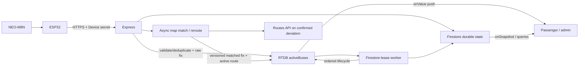

# Architecture and lifecycle summary

The authoritative design is split into [High-level design](HIGH_LEVEL_DESIGN.md), [Low-level design](LOW_LEVEL_DESIGN.md), [Firebase data model](../data/FIREBASE_DATA_MODEL.md), and [Hardware telemetry](../hardware/HARDWARE_TELEMETRY.md). This page is the short operational reference.

Hardware pushes; the backend never polls devices. Browsers do not repeatedly poll the live API: Firebase listeners push live changes and REST commands use `fetch`. `fetch` is not an alternative to polling—it is an HTTP API that could be used to implement polling.

Ride state is `pre_departure → in_service → completed`. The driver may arm only their assigned bus/route with a fresh fix. `_active_bus_locks/{busId}` makes the physical bus exclusive across routes. Stop 1 activates service, only the next ordered stop advances, and the final stop completes. GNSS/network loss changes signal/device state, never ride truth.

RTDB `activeBuses/{busId}_{routeId}` is the current projection. Firestore `active_rides/{busId}_{routeId}` is minimal recovery; `ride_sessions` and `completed_trips` are history. Completion and abandoned cleanup compare session IDs before deleting recovery/lock or changing RTDB, so delayed old work cannot damage a new session.

The live projection keeps authenticated raw GNSS separate from the accepted route match. Matching uses the armed direction's independently routed carriageway, heading and previous along-route progress. A single outlier only enters `POSSIBLE_OFF_ROUTE`; three reliable moving samples confirm deviation. Rerouting continues toward the next required stops while ingestion remains live, and version/session/request guards prevent stale route restoration.

Security boundaries: device assignment comes from protected Firestore; device secrets are independent salted scrypt verifiers; browser API calls use Firebase bearer tokens and server role/assignment checks; Firebase is default deny and live writes/internal collections are server-only. Authenticated/unknown network responses are not service-worker cached.

Performance: one shared RTDB listener per browser, a one-second moving publish cadence, a five-second stationary heartbeat, seven-second HTTPS timeout, jittered backoff, Firestore only on lifecycle changes, and local polyline ETA math. Admin-only `GET /api/health` reports rolling processing, device-queue, network, device-to-server, and RTDB-write latency percentiles, while public `GET /health` is readiness-only. Physical-route latency and GNSS reliability still require the acceptance runbook.
