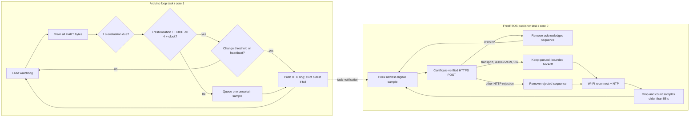

# Hardware telemetry, latency and failure design

## Electrical and physical setup

| ESP32 | NEO-M8N | Purpose |
|---|---|---|
| `5V/VIN` | `VCC` | Regulated 5 V supply (confirm module voltage) |
| `GND` | `GND` | Common reference |
| `GPIO16 / RX2` | `TX` | NMEA into ESP32 |
| `GPIO17 / TX2` | `RX` | Optional configuration channel |

Use a fused automotive-rated 12 V-to-5 V buck converter, strain relief, protected enclosure, stable ground and clear-sky active antenna placement. Do not power an uncertain-voltage GNSS board from 5 V without checking its specification. A separate operator—not the driver—must observe the system while moving.

## Firmware build contract

- Board/framework: `esp32dev`, Arduino, `huge_app.csv`; OTA compiled disabled.
- Pinned platform/libraries: Espressif32 7.0.1, TinyGPSPlus 1.1.0, ArduinoJson 7.4.3.
- Secrets: ignored `include/secrets.h` copied from `secrets.example.h`.
- Required: `WIFI_SSID`, `WIFI_PASS`, `DEVICE_ID`, 20+ character `DEVICE_SECRET`, HTTPS `BACKEND_URL`, and issuing `BACKEND_ROOT_CA`.
- `BACKEND_URL` is runtime-checked for `https://`; insecure configuration halts transmission.

## Runtime tasks

The two tasks share only a short critical section around the fixed-capacity ring. TLS can consume its full connect/request timeout without delaying NMEA parsing. The 8,192-byte UART buffer remains as protection against scheduler and diagnostic jitter, while HardwareSerial buffer/FIFO overflow callbacks and TinyGPSPlus checksum failures make any loss observable.

The 120-sample queue occupies 5,808 bytes of RTC no-init memory. At the maximum one capture per three seconds it covers six minutes; heartbeats consume less. It survives software/watchdog resets, rejects recovery when the device/backend identity or queue layout changes, and drops the oldest entry on overflow. The backend accepts timestamps only within 60 seconds, so recovery sends newest-first and purges entries outside a 55-second safety margin rather than replaying invalid data.

## Fix quality and transmission parameters

| Parameter | Value | Purpose |
|---|---:|---|
| Evaluation period | 1 s | Consume current GNSS state |
| GNSS age maximum | 5 s | Reject stale parser fixes |
| HDOP maximum | 4.0 | Reject poor horizontal geometry |
| Moving enter / stopped enter | 2.5 / 1.5 km/h | Hysteresis against jitter |
| Confirmation readings | 3 | Stable motion classification |
| Minimum changed capture | 3 s | Upper bound queue/write frequency |
| Distance change | 5 m | Position materiality |
| Heading change | 15° | Direction materiality |
| Speed change | 5 km/h | Velocity materiality |
| Moving/stopped heartbeat | 30 / 60 s | Liveness without excess writes |
| HTTP connect/request timeout | 7 s | Bound blocked network work |
| HTTPS retry | 1–30 s + up to 1 s jitter | Recovery without fleet retry storm |
| RTC queue | 120 samples / 5,808 bytes | Bounded store-and-forward with oldest-drop overflow |
| Queued-fix discard | >55 s | Stay within backend freshness window |
| Task watchdog | 25 s, panic/restart | Cover both tasks and bounded connect-plus-request latency |
| NMEA no-data warning | after 5 s, every 5 s | Wiring/baud diagnosis |

Wi-Fi persistence is disabled to avoid flash churn, auto-reconnect is enabled, the strongest known AP is selected with fast scan, and modem sleep is disabled because the tracker is vehicle-powered and latency is preferred over battery life. The SSID and secret are never logged.

The deterministic distance, heading, three-reading motion hysteresis, retry and capture decisions live in `hardware/include/telemetry_policy.h`; queue ordering, wraparound, retry retention, identity validation, overflow and stale eviction live in `hardware/include/telemetry_queue.h`. Both are executed on the host by `platformio test -d hardware -e native`. Radio, UART, antenna, TLS, watchdog and power behavior remain physical acceptance concerns.

## Payload and HTTP outcomes

The body fields and limits are defined in [Firebase data model](../data/FIREBASE_DATA_MODEL.md#activebusesbusid_routeid) and [Backend API](../backend/API.md). The device treats only 200/202 as success. Transport errors, 408/425/429 and 5xx retain the attempted sample for retry; other HTTP statuses remove that sample so a permanent 4xx is not replayed forever. HTTP 429 honors the backend's bounded delta-seconds `Retry-After` value. If a newer fix arrives while a request is in flight, that newer fix becomes the next recovery candidate.

| Symptom | Likely cause | Action |
|---|---|---|
| No NMEA warning | RX/TX reversed, no GNSS power, wrong baud | Check wiring/LED/serial at 9,600 |
| Never gets valid fix | Indoor/multipath antenna, HDOP >4 | Move antenna to sky view; inspect GNSS output |
| NTP not synchronized | Wi-Fi/DNS/UDP blocked | Verify hotspot and NTP reachability |
| Boot reports template placeholders | `secrets.h` was copied but not configured | Provision the device and replace every template value; never commit the file |
| Negative HTTPClient/transport failure | DNS/backend unreachable, wrong hostname/CA, expired issuer, bad clock | Use the printed transport string; verify URL chain and NTP; never use insecure mode |
| HTTP 400 | Firmware/backend contract mismatch or timestamp/range | Compare exact six fields and clock |
| HTTP 401 | ID/secret disabled/mismatched or assignment invalid | Reprovision/inspect registry without logging secret |
| HTTP 429 | IP/device limiter | Check publish loop/config and WAF limits |
| HTTP 503/timeouts | Backend/Firebase/network outage | Inspect `/health`; backoff retains the bounded queue |
| Repeated watchdog reset | HTTP/network stack longer than 25 s or task fault | Inspect reset reason/serial; verify 7 s connect/request timeouts |
| Non-zero overflow counters | GNSS task starvation, UART pressure or full telemetry queue | Inspect 30-second health line; reproduce against network outage and load |
| `uncertain` on map | One GNSS-loss notification at last trusted point | Fix antenna/sky view; no guessed motion is shown |

## Latency analysis

The device serial line is not the normal bottleneck: NMEA parsing continues while HTTPS blocks the publisher task. For a materially changed fix, designed latency is up to one-second evaluation plus network/TLS/API/RTDB time; a change arriving just after capture can also wait for the three-second floor. On recovery the newest eligible state is restored first. If no material change occurs, heartbeat visibility is intentionally 30/60 seconds.

Backend `/health.telemetry` provides:

- `processingLatencyMs`: API service processing, including credential/RTDB work.
- `deviceToServerLatencyMs`: server receipt minus device NTP timestamp; includes sampling gate and network but is trustworthy only with a correct clock.
- `rtdbWriteLatencyMs`: RTDB transaction duration.
- `credentialCacheHitRate`, accepted/rejected counters and last times.

Each latency is a rolling in-process 512-sample window with average/p50/p95/p99. Measure these on the actual route along with GNSS fix age, cellular RTT, browser display time and RSSI. A server restart intentionally resets metrics.

## Points of failure and mitigations

| Point | Detection | Software behavior | Remaining action |
|---|---|---|---|
| Vehicle power/buck/cable | Board resets/no telemetry | Reset reason logged; durable ride retained | Automotive wiring/spares/monitoring |
| GNSS receiver/antenna/UART | No NMEA, quality rejection, checksum or UART overflow count | Warning; one uncertain projection; 30 s counters | Physical inspection/route survey |
| Wi-Fi/hotspot | Disconnect/RSSI/timeouts | Auto reconnect, RTC queue and backoff | Coverage/SIM/hotspot redundancy |
| Clock | No TLS/invalid timestamp | NTP retry; no invalid fix publish | Allow NTP or provision time strategy |
| TLS CA rotation | TLS failure | Fail closed | Signed OTA before issuer expiry |
| Device credential | 401/rejected metric | No Firebase access; negative cache | Disable/rotate securely |
| Backend/Firebase | 503/latency metrics | Bounded queue retained; jitter retry | Regional managed runtime/alerts |
| Process restart | health/worker lease | Durable active ride and reconnect | Runbook/availability deployment |
| GNSS gap | uncertain/stale UI | No dead-reckoned authoritative point | Accept interruption or add separately-labelled estimate only after safety review |

## Security deployment

Firmware source cannot safely automate irreversible eFuses. Before fleet use, establish signed binaries/OTA rollback and key custody; test Secure Boot V2 and flash encryption on spare boards; then provision production boards. Rotate each device independently. Keep Wi-Fi/device secrets and CA material out of source/build logs. Maintain a CA/firmware expiry calendar.

## Physical acceptance

Bench compile is necessary but insufficient. Test cold/warm GNSS acquisition, stationary drift, urban multipath, tunnel/covered loss, Wi-Fi loss/recovery, backend outage/recovery, power cycling during active ride, CA/credential rejection, long HTTP failure, every route geofence in order, and final completion. Record p50/p95/p99 display latency, serial reset/failure logs, commit, firmware hash, route/weather and evidence.
