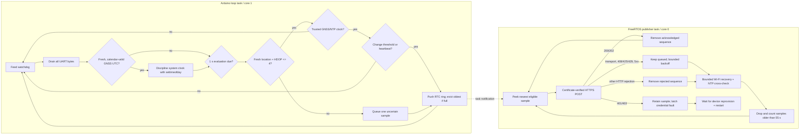

# Hardware telemetry, latency and failure design

## Electrical and physical setup

| ESP32 | NEO-M8N | Purpose |
|---|---|---|
| `5V/VIN` | `VCC` | Regulated 5 V supply (confirm module voltage) |
| `GND` | `GND` | Common reference |
| `GPIO16 / RX2` | `TX` | NMEA into ESP32 |
| `GPIO17 / TX2` | `RX` | Optional configuration channel |

Use a fused automotive-rated 12 V-to-5 V buck converter, strain relief, protected enclosure, stable ground and clear-sky active antenna placement. Do not power an uncertain-voltage GNSS board from 5 V without checking its specification. A separate operator—not the driver—must observe the system while moving.

## Firmware build contract

- Development: `esp32dev`, Arduino, `huge_app.csv`; OTA compiled disabled.
- Fleet: `esp32dev-secure`, Arduino as an ESP-IDF component, Secure Boot V2, release-mode flash encryption, encrypted NVS, ROM-download lockdown, and a bootloader-safe custom partition table.
- Pinned platform/libraries: Espressif32 7.0.1, TinyGPSPlus 1.1.0, ArduinoJson 7.4.3.
- Runtime configuration: one validated, versioned, checksummed NVS record containing Wi-Fi, device ID/base64url secret, HTTPS backend origin, and issuing root CA. No operational credential is compiled into firmware.
- Local access: a random 24-character password is generated per device and stored in NVS; the complete protected provisioning form never returns stored values.
- Fleet runtime refuses to read configuration or start networking unless flash encryption and Secure Boot both report active.

## Runtime tasks

The two tasks share only short critical sections around the fixed-capacity ring and fault counters. TLS can consume its full connect/request timeout without delaying NMEA parsing. The 8,192-byte UART buffer remains as protection against scheduler and diagnostic jitter, while HardwareSerial buffer/FIFO overflow callbacks and TinyGPSPlus checksum failures make any loss observable.

Fresh TinyGPSPlus date/time (maximum two-second age, strict calendar/range validation) is converted without timezone-sensitive `mktime` and applied using `settimeofday`. This establishes TLS-valid time before Wi-Fi/NTP is available and corrects drift of at least 1.5 seconds no more than once per minute. Once Wi-Fi connects, SNTP is scheduled as a six-hour cross-check/fallback. GNSS remains the primary discipline source; invalid/stale GNSS time is never applied.

The 120-sample queue occupies 5,808 bytes of RTC no-init memory. At the maximum one capture per three seconds it covers six minutes; heartbeats consume less. It survives software/watchdog resets, rejects recovery when the device/backend identity or queue layout changes, and drops the oldest entry on overflow. The backend accepts timestamps only within 60 seconds, so recovery sends newest-first and purges entries outside a 55-second safety margin rather than replaying invalid data.

## Fix quality and transmission parameters

| Parameter | Value | Purpose |
|---|---:|---|
| Evaluation period | 1 s | Consume current GNSS state |
| GNSS age maximum | 5 s | Reject stale parser fixes |
| HDOP maximum | 4.0 | Reject poor horizontal geometry |
| Moving enter / stopped enter | 2.5 / 1.5 km/h | Hysteresis against jitter |
| Confirmation readings | 3 | Stable motion classification |
| Minimum changed capture | 3 s | Upper bound queue/write frequency |
| Distance change | 5 m | Position materiality |
| Heading change | 15° | Direction materiality |
| Speed change | 5 km/h | Velocity materiality |
| Moving/stopped heartbeat | 30 / 60 s | Liveness without excess writes |
| HTTP connect/request timeout | 7 s | Bound blocked network work |
| GNSS UTC maximum age | 2 s | Reject stale date/time sentences |
| GNSS correction | >=1.5 s, at most once/minute | Primary clock discipline without rapid jumps |
| NTP cross-check | startup after Wi-Fi, then six-hour schedule | Independent fallback/check; not a publish dependency |
| Wi-Fi retry / escalation | 5-60 s exponential / 2 min | Bound radio churn; enter technician recovery mode |
| HTTPS retry | 1–30 s + up to 1 s jitter | Recovery without fleet retry storm |
| RTC queue | 120 samples / 5,808 bytes | Bounded store-and-forward with oldest-drop overflow |
| Queued-fix discard | >55 s | Stay within backend freshness window |
| Task watchdog | 25 s, panic/restart | Cover both tasks and bounded connect-plus-request latency |
| Remote diagnostics | first at 30 s, then every 5 min while idle | Authenticated bounded health without delaying a queued fix |
| NMEA no-data warning | after 5 s, every 5 s | Wiring/baud diagnosis |

Wi-Fi SDK persistence is disabled to avoid reconnect churn, auto-reconnect is enabled, the strongest known AP is selected with fast scan, and modem sleep is disabled because the tracker is vehicle-powered and latency is preferred over battery life. An unprovisioned unit exposes the WPA2 `Eki-Recovery-*` portal immediately; a configured unit exposes it after a continuous two-minute outage or a 401/403. The HTTP listener is bound specifically to the fixed soft-AP address `192.168.4.1`, and every handler independently rejects sockets whose local destination is not that AP address. Credential faults disable the station radio before starting AP-only recovery; outage recovery may keep STA retries active without exposing the listener on the STA address. The form requires every configuration field, validates one closed NVS record, and restarts without returning stored credentials. A successful station connection stops outage recovery. GPIO2 emits two short pulses for recovery mode and three for a latched credential fault. The fleet build and runtime gate make flash/NVS encryption mandatory in vehicles.

Deterministic UTC conversion/discipline lives in `hardware/include/clock_policy.h`; Wi-Fi escalation and LED patterns in `hardware/include/connectivity_policy.h`; distance, heading, motion hysteresis, HTTP outcomes and capture decisions in `hardware/include/telemetry_policy.h`; and queue ordering/recovery in `hardware/include/telemetry_queue.h`. The hardware-specific, local-only credential portal is isolated in `hardware/src/recovery_portal.cpp`. Pure policies are executed on the host by `platformio test -d hardware -e native`. Radio, UART, antenna, TLS, portal interoperability, watchdog and power behavior remain physical acceptance concerns.

## Payload and HTTP outcomes

The body fields and limits are defined in [Firebase data model](../data/FIREBASE_DATA_MODEL.md#activebusesbusid_routeid) and [Backend API](../backend/API.md). The device treats only 200/202 as telemetry success. Transport errors, 408/425/429 and 5xx retain the attempted sample for retry; other permanent HTTP statuses remove that sample. HTTP 401/403 retains the rejected sample, latches a credential fault, blocks further telemetry, and enables protected full reprovisioning so a doomed secret cannot create an infinite loop. Normal freshness eviction still prevents an old retained sample from violating the backend's timestamp contract. HTTP 429 honors the bounded delta-seconds `Retry-After` value. If a newer fix arrives during a retryable request, it becomes the next recovery candidate. Remote diagnostics is a separate best-effort 1 KiB POST containing only bounded counters/state; its failure never evicts or delays a queued fix.

| Symptom | Likely cause | Action |
|---|---|---|
| No NMEA warning | RX/TX reversed, no GNSS power, wrong baud | Check wiring/LED/serial at 9,600 |
| Never gets valid fix | Indoor/multipath antenna, HDOP >4 | Move antenna to sky view; inspect GNSS output |
| Clock not synchronized | Stale/invalid GNSS date-time and NTP blocked | Check NMEA date/time freshness; then Wi-Fi/DNS/UDP |
| Boot says awaiting provisioning | No valid NVS configuration record | Use the controlled serial recovery password and protected local portal |
| Fleet firmware halts at security gate | Flash encryption or Secure Boot inactive | Quarantine the unit; repeat only the witnessed spare-board procedure, never bypass the gate |
| Negative HTTPClient/transport failure | DNS/backend unreachable, wrong hostname/CA, expired issuer, bad clock | Use the printed transport string; verify URL chain and NTP; never use insecure mode |
| HTTP 400 | Firmware/backend contract mismatch or timestamp/range | Compare exact six fields and clock |
| HTTP 401/403 + three LED pulses | ID/secret disabled/mismatched or assignment invalid | Rotate/inspect registry, then submit the complete replacement configuration locally |
| HTTP 429 | IP/device limiter | Check publish loop/config and WAF limits |
| HTTP 503/timeouts | Backend/Firebase/network outage | Inspect `/health`; backoff retains the bounded queue |
| Repeated watchdog reset | HTTP/network stack longer than 25 s or task fault | Inspect reset reason/serial; verify 7 s connect/request timeouts |
| Two LED pulses / `Eki-Recovery-*` AP | Unprovisioned, station outage exceeded two minutes, or configuration recovery | Join with the device recovery password; submit the complete configuration at `192.168.4.1` |
| Non-zero overflow counters | GNSS task starvation, UART pressure or full telemetry queue | Inspect authenticated remote diagnostics; reproduce against network outage and load |
| `uncertain` on map | One GNSS-loss notification at last trusted point | Fix antenna/sky view; no guessed motion is shown |

## Latency analysis

The device serial line is not the normal bottleneck: NMEA parsing continues while HTTPS blocks the publisher task. For a materially changed fix, designed latency is up to one-second evaluation plus network/TLS/API/RTDB time; a change arriving just after capture can also wait for the three-second floor. On recovery the newest eligible state is restored first. If no material change occurs, heartbeat visibility is intentionally 30/60 seconds.

Backend `/health.telemetry` provides:

- `processingLatencyMs`: API service processing, including credential/RTDB work.
- `deviceToServerLatencyMs`: server receipt minus device GNSS/NTP-disciplined timestamp; includes sampling gate and network but is trustworthy only with a correct clock.
- `rtdbWriteLatencyMs`: RTDB transaction duration.
- `credentialCacheHitRate`, accepted/rejected counters and last times.

Each latency is a rolling in-process 512-sample window with average/p50/p95/p99. Measure these on the actual route along with GNSS fix age, cellular RTT, browser display time and RSSI. A server restart intentionally resets metrics.

## Points of failure and mitigations

| Point | Detection | Software behavior | Remaining action |
|---|---|---|---|
| Vehicle power/buck/cable | Board resets/no telemetry | Reset reason logged; durable ride retained | Automotive wiring/spares/monitoring |
| GNSS receiver/antenna/UART | No NMEA, quality rejection, checksum or UART overflow count | Warning; one uncertain sample; 30 s counters | Physical inspection/route survey |
| Wi-Fi/hotspot | Disconnect/RSSI/timeouts | Exponential retry, RTC queue, protected local recovery and two-pulse LED | Coverage/SIM/hotspot redundancy; field-test portal |
| Clock | No TLS/invalid timestamp | Fresh GNSS UTC primary; NTP cross-check/fallback; no invalid publish | Validate receiver UTC and NTP paths on target hardware |
| TLS CA rotation | TLS failure | Fail closed | Signed OTA before issuer expiry |
| Device credential | 401/403, rejected metric, three-pulse LED | Publishing latches off; protected local reprovisioning starts | Rotate registry secret, submit complete config, verify diagnostics |
| Hardware security | Boot gate and remote diagnostic booleans | Fleet firmware halts unless both protections are active | Witness first boot and retain spare-board evidence |
| Backend/Firebase | 503/latency metrics | Bounded queue retained; jitter retry | Regional managed runtime/alerts |
| Process restart | health/worker lease | Durable active ride and reconnect | Runbook/availability deployment |
| GNSS gap | uncertain/stale UI | No dead-reckoned authoritative point | Accept interruption or add separately-labelled estimate only after safety review |

## Security deployment

The `esp32dev-secure` environment builds a signed Secure Boot V2 image with release-mode flash/NVS encryption and ROM-download lockdown. Its first boot irreversibly provisions security eFuses, so repository automation never uploads it. Follow the witnessed [fleet security and provisioning procedure](../operations/HARDWARE_SECURITY_PROVISIONING.md) on spare ECO3-or-newer boards, retain evidence, and only then approve production units. Rotate devices independently, keep credentials and key material out of source/build logs, and maintain CA/firmware/signing-key lifecycle records. Signed OTA/rollback remains required before routine fleet updates.

## Physical acceptance

Bench compile is necessary but insufficient. Test cold/warm GNSS acquisition, stationary drift, urban multipath, tunnel/covered loss, Wi-Fi loss/recovery, backend outage/recovery, power cycling during active ride, CA/credential rejection, long HTTP failure, every route geofence in order, and final completion. For recovery specifically, verify that outage AP+STA mode serves `192.168.4.1` only after joining the recovery AP while the station IP refuses/does not answer port 80; verify a credential fault drops STA and starts AP-only mode; submit six invalid protected actions within a minute and observe the sixth return 429; rotate the password, record the returned value, then confirm after restart and a power cycle that the old password fails and the new password joins. Record p50/p95/p99 display latency, serial reset/failure logs, commit, firmware hash, route/weather and evidence.
