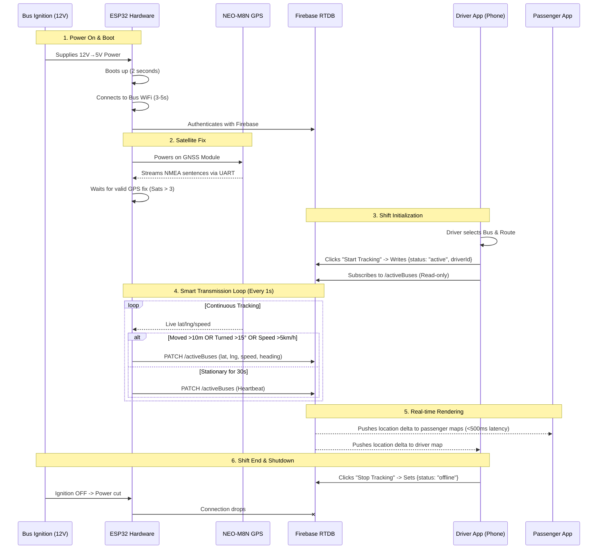
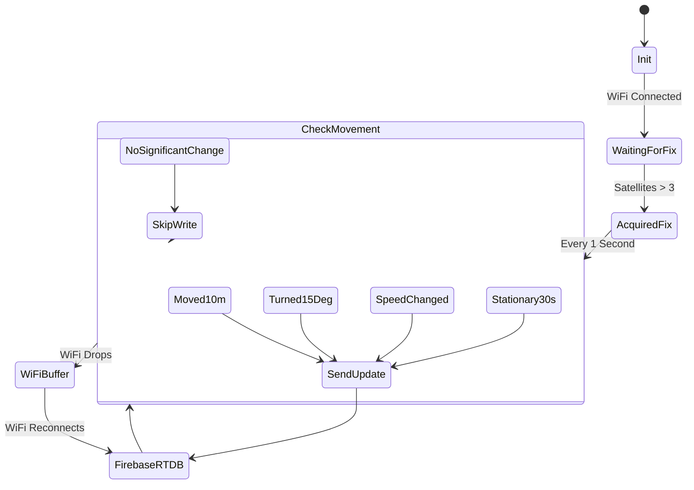

# BusTrack GNSS App Workflow

Here is the complete end-to-end workflow of the new GNSS hardware-based tracking system, explained visually.

## 1. Physical Hardware & Data Flow

When the driver turns the bus ignition on, the hardware automatically powers up and takes over the GPS tracking without any driver intervention. The driver app simply acts as a shift controller.

## 2. Smart Transmission State Machine

The biggest cost-saver in the new architecture is the ESP32's Smart Transmission logic. It evaluates the physical movement of the bus to decide whether sending data to Firebase is necessary.

## Step-by-Step Breakdown

1. **Ignition & Power**: The moment the driver turns the bus key, the 12V cigarette lighter powers the USB adapter, booting the ESP32.
2. **Connectivity**: The ESP32 connects to the onboard bus WiFi and authenticates with Firebase. Simultaneously, the NEO-M8N searches for satellites.
3. **Driver Shift Start**: The driver opens their phone, selects their bus/route, and hits "Start Tracking". Since we removed the hybrid mode, this action **does not activate their phone's GPS**. It merely writes the shift metadata (who is driving) to Firebase and waits.
4. **Smart Telemetry**: As the bus drives, the ESP32 parses NMEA data. If the bus moves in a straight line on a highway, it sends updates only every ~100 meters. If it takes a sharp turn, it immediately sends a packet so the map marker follows the corner smoothly. If it stops at a red light, it falls silent, sending only one "heartbeat" ping every 30 seconds to prove it's still online.
5. **Display**: The Firebase Realtime Database instantly pushes these hardware-generated updates to every passenger's phone, and back to the driver's phone, which renders the position on the screen.
